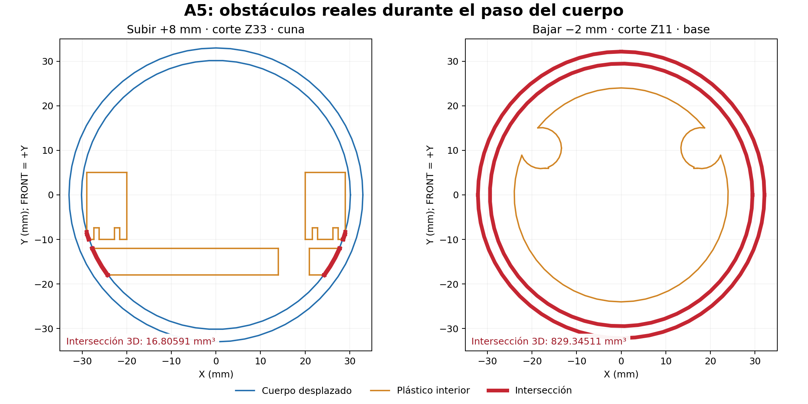

# Revisión de integración mecánica y alimentación

Fecha: 20 de septiembre de 2026. Unidades mecánicas: mm; volúmenes de interferencia: mm³. Alcance: A5 existente + módulos comerciales, conservando silueta, electrónica separada, antena, IMU, eje de jalón y FRONT (+Y). No se ha fabricado ni energizado nada durante esta revisión.

## Conclusión

**Los dos trabajos no se pueden dar por construibles juntos en su estado de entrada.** El panel corresponde a un A5 anterior; al regenerarlo contra el A5 actual aparecen diez interferencias y el exportador falla. Se corrigió esa integración local y se regeneraron CAD/STEP/STL, pero siguen abiertos el paso de montaje del cuerpo sobre el chasis, las fijaciones y conectores de alimentación, el arnés completo y la retención del inserto de jalón.

**El receptor completo no está listo para una impresión de armado. Sí hay geometría para ensayos parciales de panel, botón, USB y tolerancias.** Una malla cerrada o un conjunto sin choques en posición final no resuelve el montaje ni valida las piezas compradas.

| Pregunta solicitada | Resultado |
| --- | --- |
| A. ¿Compatibles? | Parcialmente. Panel corregido compatible con reservas A5 en posición final; producto completo pendiente por montaje, power, cableado y jalón. |
| B. ¿Problemas? | Desfase de versiones, diez invasiones iniciales, cabezas de tornillo inconsistentes, recorrido axial del cuerpo bloqueado, módulos power sin anclajes, cable de batería/guía óptica sin ruta cerrada e inserto libre para girar. |
| C. ¿Corregido? | Generador adaptado a `Chassis`, despejes locales, asiento plano para M3 existente, cabezas M2 normalizadas y su holgura; salidas separadas para preservar archivos originales. |
| D. ¿Simplificado? | Panel usa los mismos M3×8 de los otros cierres; se elimina el requisito contradictorio de M3 avellanados. No se elimina una fijación estructural. |
| E. ¿Tornillos? | **21 definidos: 10 M3 + 5 M2.5 + 6 M2; 12 tuercas.** Faltan fijaciones del inserto y otras placas; no es un total final de producto. |
| F. ¿5/8-11 hembra? | Es la especificación correcta y la del candidato McMaster existente; el archivo contiene una envolvente, no una interfaz física verificada. |
| G. ¿Inserto centrado/retenido? | Centro nominal X=Y=0, sí. Antigiro y retención axial positiva, **no demostrados ni completados**. |
| H. ¿Mediciones? | Lista concreta al final: inserto/jalón, conectores, pack, carriers, pulsador, cables y montaje real. |
| I. ¿Primera impresión? | Cupones y panel para pruebas parciales, sí. Receptor entero para ensamblarlo, **no**. |

Entregables: [CAD y reproducción](../mechanical/integration-review/README.md), [auditoría numérica](../mechanical/integration-review/generated/integration-audit.json), [fit del panel](../mechanical/integration-review/generated/fit-report.json), [BOM mecánica](../mechanical/MECHANICAL_BOM.md).

## Evidencia y fuentes de verdad

Se leyó `AGENTS.md` de la raíz; la búsqueda en el repositorio no encontró otros aplicables. Se revisaron README, arquitectura/estado, identificación y BOM, wiring, documentación A5/IMU/impresión, archivos del panel y power-modules, antecedentes power-board y código/configuración de firmware pertinente. Los antecedentes `legacy` se consultaron sólo para identificar el inserto y las ranuras; no son dependencias del modelo actual.

| Archivo / conjunto | Evidencia de entrada | Autoridad en esta revisión |
| --- | --- | --- |
| `mechanical/A5/TresVizo-A5.FCStd` | Modificado 12:30:28 local; SHA-256 `73fd95f536f6537bbcbc9e3633d12d050ab901e844b4a03dcd79d3889115f4fb` | Base autoritativa de forma, ejes y arquitectura. Se conserva byte a byte. 44 sólidos individuales, excluyendo grupos. |
| `mechanical/panel-modules/TresVizo-panel-modules.FCStd` y STEP/STL originales | 12:19; el fit anterior usa A5 SHA `9ec44ad322678a9afdcbc1ade62cc33b0a1f4143c4ffee333d027fdf2c8d15e5` | Entrega anterior válida sólo contra su fuente. No combinar sus copias `Base/ElectronicsTray` con el `Chassis` fusionado. Se conserva. |
| `mechanical/panel-modules/build_panel.py` + `parameters.json` | Generador real, antes esperaba `ElectronicsTray` | Fuente paramétrica de la variante de panel; corregida aquí. Salida vigente de revisión en `mechanical/integration-review/generated/`. |
| `hardware/power-modules/README.md`, `WIRING.md`, `PANEL.md` | Selección de tres módulos y arnés del 20/09 | Arquitectura eléctrica vigente para esta revisión. No existe montaje power físico completo en el CAD. |
| `hardware/power-board/` e `mechanical/integration/power_board_interface.json` | Documentación de PCB personalizada cancelada; STEP enlazado ausente | Antecedentes. Sus 45×40 mm y resultados ERC/DRC no validan módulos comerciales. |
| README raíz, `hardware/bom.md`, `docs/project-status.md` | Párrafos históricos dicen sin CAD, antena sin identificar o alimentación aún sin propuesta | No prevalecen sobre sólidos y documentos de componentes posteriores. No convierten una propuesta en hardware ensayado. |

`mechanical/A5/PCB-INTERFACE.md` y la guía A5 todavía pedían esperar una PCB personalizada; esa restricción corresponde a la tarea anterior y quedó sustituida por el alcance modular de esta solicitud. La identificación Tiny también tiene dos evidencias distintas: memoria 4 MB/2 MB de una unidad por USB frente a N8R8 declarada posteriormente. Se mantiene el conjunto Tiny/FPC/Adapter real y no se cambia firmware por suposición.

Estado Git inicial: trabajo previo sin commit, incluidas **371 eliminaciones** bajo la propuesta PCB, cinco archivos modificados y carpetas nuevas. Se conserva ese estado ajeno; no se restauraron ni borraron sus archivos. HEAD inicial `cc9f585`. No hubo commit, push, rebase ni cambios de configuración Git. [Estado inicial](../mechanical/integration-review/evidence/git-status-before.txt) y [huellas de entradas](../mechanical/integration-review/evidence/input-manifest.json).

## Qué significa cada comprobación

- **VERIFICADO POR GEOMETRÍA:** operación BREP/medición CAD sobre los sólidos y reservas identificados. No acredita dimensiones físicas de la reserva.
- **VERIFICADO POR DOCUMENTACIÓN:** dato publicado o contrato de interconexión contrastado; se identifica fabricante/revisión cuando existe.
- **ESTIMADO:** volumen o criterio de trabajo explícito, sin pretensión de ser una pieza medida.
- **PENDIENTE DE MEDIR:** falta dimensión del componente/jalón/cable real.
- **PENDIENTE DE PRUEBA FÍSICA:** impresión, rigidez, térmica, óptica, fuerza, repetibilidad o comportamiento eléctrico no ensayados.

Se empleó FreeCAD 1.1.3/OpenCascade. Umbral para informar intersección: 0.001 mm³. Se excluyen grupos compuestos para no contar dos veces sus sólidos; la plantilla IMU se retira del conjunto permanente. Se conservan en el JSON intersecciones intencionales y estudios que fallan, con su interpretación aquí.

## Interferencias y correcciones locales

La ejecución original, sobre una copia temporal, termina en `KeyError: 'A5_ElectronicsTray'`. Antes de fallar calcula las siguientes invasiones contra el A5 actual. [Registro](../mechanical/integration-review/evidence/baseline-regeneration.log), [informe inicial completo](../mechanical/integration-review/evidence/baseline-fit-report.json).

| Pieza del panel | Obstáculo A5 actual | Volumen inicial | Resolución |
| --- | --- | ---: | --- |
| Panel con apoyos | Chasis/repisa USB | 328.78072 | Despeje local de repisa y rampas del chasis. |
| Cartucho | Chasis | 14.02071 | Despeje local posterior al botón. |
| Cuerpo LED RGB | Chasis | 9.93204 | Prolongar despeje bajo USB hasta Z120.5. |
| PCB USB | Chasis | 6.92623 | Retirar apoyos antiguos incompatibles. |
| Dos tornillos USB posteriores | Chasis | 6.23906 cada uno | Mismo despeje. |
| Dos tornillos del cartucho | Chasis | 1.16394 cada uno | Despeje con holgura para cabeza real. |
| Panel | Cabezas M3 inferior / superior | 1.48801 / 2.09650 | Sustituir asiento cónico por plano para M3×8 botón. |

Al representar las cabezas M2 comerciales Ø3.8×2 en lugar de Ø3.6×1.3/1.4, se detectó además roce de las dos cabezas USB delanteras con la pared curva. Se añadieron rebajes locales con 0.2 mm radial de reserva. La comprobación separa cabeza y vástago para no ocultar este roce dentro de la penetración intencional del tornillo en su piloto.

### Registro BEFORE / AFTER / WHY / IMPACT

| BEFORE | AFTER | WHY | IMPACT |
| --- | --- | --- | --- |
| Generador esperaba `ElectronicsTray` y exportaba copias antiguas | Usa `Chassis` del A5 actual y excluye `AssemblyTools` | Hacer reproducible el conjunto real sin duplicar herramienta | Sin cambio exterior; conserva los archivos anteriores y escribe una variante derivada. |
| Repisa/rampas detrás del panel invaden apoyos, LED y cartucho | Dos vaciados parametrizados: X±11.6/Y11.5…29.1/Z120.5…134.8 y X±12.3/Y23.8…29.1/Z103…117 | Evitar colisiones con componentes del panel | Chasis conserva un sólido válido; elimina 2367.36 mm³. No toca espina Y5.3…9.3, base ni asiento IMU; resistencia de las zonas remanentes por ensayar. |
| Cuerpo A5 con acceso provisional | Acceso del panel de 25.2 de ancho, Z102…135 | Pasar apoyos y cartucho existentes del diseño del panel | Elimina 218.72 mm³; mantiene bbox exterior, ejes M3 y logo. Este recorte ya era parte del concepto del panel, ahora aplicado al A5 correcto. |
| Panel pedía M3 avellanado; A5 tenía M3 botón | Pasos Ø3.4 y asiento plano Ø6.1, planos Y36.5/37.0 | Evitar mal apoyo y un tipo de cabeza adicional | Reutiliza 2 M3×8 ISO7380. Cara de panel conserva su curva salvo los apoyos locales. |
| M2 sin cabeza comercial cerrada | Vástago Ø2, cabeza Ø3.8×2, holgura local de cabeza | Revisar con herraje normalizado | Dos llaves en el conjunto: 2 y 1.5 mm. Mantiene 4 M2×5 USB y 2 M2×8 cartucho. |
| Power y arnés ausentes de fit | Reservas de estudio con choques y límites visibles | Evitar declarar que caben sólo por omisión | No se agregan soportes ni se reubican placas reales; tampoco se asigna un montaje definitivo. |

La diferencia booleana es cero en tapa, cuna/asiento IMU, prensa, BMI088, datum IMU, ESP32, UM980, microSD, batería, inserto y reserva de coaxial. El cuerpo conserva X/Y±37 y Z12…150.2; chasis X/Y±32.18 y Z0…163.6. No se cambia el diámetro general, altura, forma de antena ni posición conceptual de módulos.

## Montaje y desmontaje: pendiente principal

**El panel completo sale hacia +Y:** 21 posiciones entre 0 y 40 mm, paso 2, sin invasiones contra las piezas permanentes consideradas, retirados sus dos M3. Debe desconectarse el arnés y disponer de lazo de servicio; las muestras no incluyen cables flexibles.

**La cuna sale hacia −Y con el cuerpo y microSD retirados:** 13 posiciones entre 0 y 24 mm, sin invasiones de los obstáculos del ensayo. Conservar los dos M3×20 y las dos guías; no quitar fijaciones IMU para reducir la cuenta.

**Deslizar el cuerpo hacia arriba sobre el conjunto bloquea el montaje:** 28 de 42 posiciones muestreadas invaden reservas o plástico real. A +4 mm ya hay 1.47725 mm³ contra la cuna; a +8 mm hay 16.80591 mm³ contra cuna y 0.03597 mm³ contra chasis. También aparecen invasiones de UM980/coaxial más adelante. No son contactos funcionales. La dirección inversa y el chasis solo se ensayan por separado en el JSON.

La dirección inversa también falla: bajar 2 mm produce **829.34511 mm³** contra la base integrada. Aun sin cuna, subir el cuerpo sobre el chasis desnudo ya encuentra choque a +8 mm. Son pruebas de traslación axial; no se investigaron exhaustivamente giros/inclinaciones ni se afirma imposibilidad de toda secuencia imaginable. La secuencia publicada, en cambio, no queda validada.

El A5 anterior validó la inserción local de cuna, no la pasada completa de la boca inferior del cuerpo sobre el chasis fusionado. **No se prescribe forzar/flexionar la carcasa ni retirar la batería por el pequeño panel.** Antes de imprimir cuerpo y base hay que cerrar una secuencia CAD realizable. Si no existe una inserción por otra orientación, revisar de forma localizada la unión base–bandeja o los pasos internos; la fusión previa no debe conservarse a costa de impedir el armado. No se deshizo automáticamente porque afecta la estructura y aún falta el montaje de power.

Secuencia propuesta de trabajo, con el punto no resuelto explícito:

1. Ensayar cupones, tuercas cautivas y pilotos. Instalar/retener el inserto metálico sólo después de medir el patrón y longitud de enganche.
2. Fuera del cuerpo, colocar tuercas en `IMUNutBar`, alinear el encapsulado con plantilla, apretar los dos M2.5 y retirar plantilla. El ajuste no equivale a calibración topográfica.
3. Colocar pack sin presión, resolver salida del cable antes de cerrar cuna; presentar guías y fijar dos M3×20. Verificar después que el datum del sensor no cambió.
4. Fijar UM980, microSD, Tiny y módulos power con sus anclajes todavía pendientes. Conectar/desconectar cada plug con cuerpo abierto; reservar lazo para panel y tapa, y alivio sobre soportes, nunca sobre IMU o bolsa.
5. Montar AU-101, actuador, RGB, óptica y placa USB en el panel fuera de la carcasa. Las cuatro llaves axiales USB y las dos IMU pasan en los subconjuntos abiertos con una reserva cilíndrica Ø3.
6. **HITO PENDIENTE: resolver la pasada del cuerpo sobre el chasis y electrónica.** Sólo entonces cerrar sus cuatro M3. No dar esta operación por resuelta por el orden escrito.
7. Conectar arnés accesible y montar panel mediante sus dos M3. Atornillar antena a tapa desde abajo, conectar coaxial y cerrar dos M3 de tapa sin pinzar cables.
8. Abrir nuevamente y repetir comprobación de desconexión, movimiento de módulos y referencia IMU/FRONT. El receptor debe poder desmontarse sin desoldar ni despegar batería.

## Revisión de componentes, tolerancias y accesos

| Componente/interfaz | Geometría / documento comprobado | Límite concreto |
| --- | --- | --- |
| UM980 BDLX | Reserva X±18/Y12.5…24.5/Z43…107; 36×12×64. Frente a 32×52×11 publicados hay margen de caja de 4/12/1 según orientación | No hay patrón físico verificado ni plugs. Las ranuras Ø2.4 no autorizan M3; medir cuatro centros/diámetros y zonas de apoyo. No se modifica RF. |
| ESP32 Tiny | X±9/Y12.5…14.95/Z139…162.5, conservada | Retención por borde provisional; pads no son agujeros. FPC y cabezales ausentes. Debe absorber esfuerzo la fijación del adaptador/panel, no la Tiny. |
| Tiny-Adapter | Reserva del panel X±9/Y18…23/Z143…161 y plug 9×5×9.2 inferior | Posición ya propuesta por panel, sin soporte; holgura respecto a Tiny 3.05 en Y no demuestra radio/longitud del FPC. BOOT/RUN requieren acceso de servicio real. |
| BMI088 | PCB 23.5×18×1.6, dos Ø3 a 18.5; asiento rígido y dos M2.5, ajuste ±0.75 XY | 1.6 y alturas de selector/pines son supuestos. El encapsulado se alinea a X=Y=0; no equivale a centro geométrico de PCB ni posición interna del sensor. Mantener entrada por −Y sin arnés tenso por encima. |
| microSD | Reserva 24×7×42, X±12/Y−25…−18/Z49…91 | Patrón de familia 38×20 no certificado para lote. Fijación, ranura, tarjeta saliente y recorrido de extracción pendientes. Requiere abrir; no se añade una ventana exterior. |
| Batería | Reserva 56×12×69; separación a chasis 0.8, a tuercas de cuna 2.84046, a tornillos de cuna 4.5; no hay invasión nominal | Contacta nominalmente la cuna; medir paquete y acolchado. La reserva es 2 mm más gruesa que el pack de referencia ajeno de 10 mm, no una tolerancia de hinchamiento validada del comprado. No usar tornillos de SD que salgan hacia la bolsa. |
| Antena | Eje nominal X=Y=0, tres M2.5, SMA central Ø16 y coaxial Ø5 de reserva conservados | Antena medida, SMA enchufado, tuerca, herramienta y radio del coaxial real pendientes. 4 mm de penetración CAD en antena frente a 6 documentados; comprobar fondo físico. No añadir metal junto a antena. |
| FRONT | Frente +Y, panel y logo asimétricos en ese lado; región de logo sin cambios booleanos | No se encontró datum angular físico calibrado del chip. Registrar orientación real de ejes y relación con FRONT después del apriete; no asumir heading por desplazamiento GNSS. |

Batería: el código 955565 no define tamaño máximo con PCM, soldaduras y cinta. Aceptar una celda sólo con holgura para su envolvente real y cambio de espesor permitido por fabricante; retirar cualquier pack hinchado. Ningún ensayo de compresión ni seguridad térmica se hizo. La batería no participa en la rigidez de la cuna/IMU. La separación nominal a herrajes actuales no cubre los tornillos futuros de SD ni la cincha.

### USB, botón y luces

USB exterior en X0/Z132, boca encastrada 1.2; paso 9.5×3.8 y rebaje 14×6.5. Una reserva redondeada de sobremolde **13×5.5×25** no invade panel/cuerpo; toca el plano del rebaje, por lo que no acredita margen axial de acoplamiento. Una de **16×8×25** invade el panel **28.97131 mm³**. Comprar/medir el cable real y comprobar longitud de metal saliente, ambas orientaciones, tracción y que el panel no flexione. No se modeló sólo la hembra, pero ninguna reserva se presenta como plug comercial ya validado.

La placa 5871 conserva cuatro apoyos y cuatro M2; el patrón procede de Eagle oficial. No se reducen a dos sin prueba de carga de inserción/extracción. La actualización incluye las cabezas reales y su holgura. El pequeño USB-C hacia Tiny también necesita fijación del adaptador y alivio; su reserva de 9.2 mm no es una referencia de compra.

Botón: cara Ø9.8 dentro de Ø10.4, holgura radial nominal 0.3; cartucho desmontable, sin cambio exterior. Juego inicial 0.1, tope a 0.4; por tanto sólo quedan 0.3 para accionar el vástago supuesto. Nueve posiciones de 0…0.4 no invaden panel/cartucho/chasis. AU-101 **no tiene dimensiones/carrera publicadas en la ficha consultada**: comprobar cuerpo, patas, altura libre/accionada y retorno; si no retorna, ajustar el cartucho, no forzar el actuador.

Se conserva un RGB para estado y una segunda ventana para carga con equipo apagado. Reducir a una sola luz requeriría resolver también alimentación/control/óptica en OFF; no se cambia la arquitectura para ahorrar un orificio ya existente. Steren publica cuerpo Ø5×8.45 y patas de 28 mm; el CAD sólo contiene cuerpo: recortar/formar/aislar patas y reservar soldaduras. Visibilidad al sol, difusión, retención removible y mezcla entre ventanas quedan a prueba física. La guía de carga desde PowerBoost no tiene aún recorrido validado; no se puede declarar visible por tener dos lentes.

## Power y cableado dentro de la carcasa

No existen soportes definitivos de PowerBoost ni SparkFun en los archivos de entrada. Para comprobar espacio sin reorganizar el producto se agregaron dos **estudios de envolvente**, sin fijaciones ni afirmación de montaje aprobado:

| Estudio | Posición XYZ | Resultado geométrico y límite |
| --- | --- | --- |
| PowerBoost 23×10×45 | X±11.5/Y−28.5…−18.5/Z94…139 | Sin choque; 0.5 a cuna y 2.62851 a cuerpo. Dimensiones exteriores publicadas incluyen USB-A, que el arnés deja sin montar. No incluye cable enchufado, anclaje ni disipación. |
| SparkFun 25.4×7.5×25.4 | X±12.7/Y−26…−18.5/Z23…48.4 | Sin choque; 0.5 a cuna, 0.6 a SD, 1.11210 a cuerpo. **7.5 de espesor es estimado**. Margen insuficiente para dar plugs/soportes por resueltos. |
| SparkFun con ocupación de 10 en Y | Misma cara interior; hacia Y−28.5 | Invade cuerpo 24.81939 mm³. Medir altura completa y conectores cambia el resultado. |
| PowerBoost con reserva de servicio 28×13×57 | X±14/Y−31…−18/Z90…147 | Invade cuerpo 219.60302, tapa 0.32236 y SD 168. No es prueba de imposibilidad general; demuestra que una caja nominal sola no cierra montaje. |

PCB oficial PowerBoost: contorno 36.068×22.86, dos barrenos de montaje en (2.54,2.54)/(2.54,20.32) locales; su USB-A explica la envolvente comercial mayor. SparkFun publica 25.4×25.4; KiCad oficial da cuatro agujeros Ø3.1 con patrón 20.32×20.32. No se perforan soportes basándose sólo en esto: faltan paquete final, orientación de JST y retención. [Fuentes y revisiones descargadas](../mechanical/integration-review/evidence/manufacturer-sources.json).

Se reservaron tramos rectos de Ø3 para arnés y Ø4 para USB, todos estimados; están en `review_parameters.json` y el FCStd de estudio. No se usan como radio de curva ni se suman como si ya estuvieran unidos.

| Enlace requerido | Ruta/volumen revisado | Pendiente |
| --- | --- | --- |
| Batería → cargador | Prueba transversal a Z109, X−18, hacia atrás | **Falla: 82.823 mm³ con cuna.** Medir salida del pack, ubicar conector y resolver paso/alivio antes de tallar un canal junto a IMU. No pasar a través de la pared. |
| Power → ESP32 y UM980 | Tramo frontal derecho X20/Y20/Z43…130, Ø3, sin invasiones | Faltan unión desde cargador, derivaciones, fusibles, conectores y llegada a placas. Mantener pares de alimentación cortos y alejados de coaxial cuando sea posible. |
| ESP32 ↔ UM980 | Mismo corredor lateral frontal como estudio de trayecto | Dimensionar haz total: Ø3 no acredita simultáneamente todos los cables de potencia y UART. Confirmar TTL frente a RS232 de carrier. |
| ESP32 ↔ BMI088 | Entrada lateral X−20…−10/Y−15/Z128, Ø3, libre nominalmente | Confirmar altura de pines, retener antes del breakout y dejar lazo sin carga sobre sensor; no cruzar su centro. |
| ESP32 ↔ microSD | Corredor trasero izquierdo X−17/Y−22/Z51…132, Ø3, libre | Faltan plugs, giro hacia contactos y holgura para extraer tarjeta. |
| Botón → SparkFun / PUSH-OFF → ESP32 | Cartucho accesible al extraer panel; corredores laterales disponibles por tramos | No hay ruta completa desde estudio de switch inferior. Lazo de servicio, protección de patas y puntos de desconexión por definir. |
| LEDs | RGB próximo a lente; guía de carga estudiada a X16/Z137 | Trayecto recto hacia carga invade coaxial 31.25144 y chasis 25.17685. Redirigir óptica, sin mover IMU/coaxial a ciegas. |
| USB exterior → Tiny-Adapter | Tramo X−13/Y19/Z133…151, Ø4, libre | Faltan curvas, extremo real, derivación VBUS y FPC. No usar un pliegue de 180° a la salida. |

Antes de cerrar: plugs completos y sus barridos de desconexión, terminales, portafusibles, transistores/resistencias del arnés, termoencogible y amarres deben agregarse a las reservas. No se ha resuelto esta lista añadiendo una motherboard ni reemplazando módulos. Separación RF/boost y térmica necesitan ensayo con GNSS, carga, Wi-Fi y SD activos; no existe distancia universal que garantice ruido aceptable.

## Congruencia eléctrica

La arquitectura comercial tiene sentido como **prototipo condicionado**; faltan verificaciones que impiden certificarla como lista para conectar. No se rediseñó el circuito. Se contrastaron los archivos oficiales de los tres módulos; no se transfirieron las conclusiones de la PCB Rev A cancelada.

| Tema | Resultado |
| --- | --- |
| LiPo/cargador | 1S nominal 3.7 V es coherente con PowerBoost 1000C. Confirmar carga máxima 4.2 V/1 A, PCM, polaridad y corriente del pack comprado. Capacidad 5000 mAh no garantiza esas corrientes. |
| Power-path | USB al pad USB, batería a BAT, VS al switch; GND común. VS sigue batería o fuente USB, no es la salida elevada. |
| Encendido | SparkFun VIN=VS, VOUT→EN, 10 kΩ a GND. Con pull-up 200 kΩ del PowerBoost, OFF ideal EN/VS=10/(200+10)=0.0476. Es cálculo documental, no medida. Mantener control corto. |
| Pulsador y señales | AU-101 NA a BTN/GND; PUSH es drenador abierto y lleva pull-up a la 3V3 propia de Tiny. OFF alto solicita corte; KiCad SparkFun muestra entrada mediante R6→compuerta BSS138 y pull-down R7, no conexión directa a una salida de 5 V. |
| Distribución | Salida aproximadamente 5.2 V. Carrier BDLX documentada 4.0–5.5 V admite nominalmente ese nivel; margen máximo 0.3 V exige medir overshoot/caída. Tiny por Adapter y regulador, nunca GPIO; confirmar variante real. BMI088 y SD necesitan los rails de sus breakouts, aún sin esquema físico verificado. |
| Presupuesto | 1 A a 5.2 V equivale a 5.2 W; a batería 3.1 V y eficiencia **estimada** 85%, son ~1.97 A de entrada. Fusible, cable, PCM, conectores y térmica deben soportar el pico real. No se verificó margen de corriente total ni autonomía. |
| USB/backfeed | Mantener USB_VBUS exterior separado de SYSTEM_5V. Los pads VBUS de canales del 5871 no son fuentes aisladas. No conectar un cable de cuatro hilos directo desde ellos a Tiny alimentada por boost. Cable interno: datos canal 1, masa común y VBUS sólo de SYSTEM_5V. |
| USB del host | PowerBoost no negocia el presupuesto de una computadora. `CHARGE_LINK` abierto en puerto de capacidad desconocida, operación desde batería. Una fuente documentada de 5 V/2 A no sustituye verificar corriente autorizada por el puerto/cable. |
| Self-powered | El switch de datos y Q1 no prueban umbrales/tiempo VBUS, comportamiento al retirar USB, ROM/JTAG ni estados con rail intermedio. Pendiente ensayo; ESD del sistema también sin completar. |
| Descarga y apagado | LBO indica batería baja, no sustituye protección PCM ni cierre de archivos; el arnés actual no define aviso temprano de batería baja hacia firmware. No unir LBO a EN ni a GPIO 3.3 V directamente. Cerrar este pendiente para registro fiable. |
| Temperatura | PowerBoost no mide la temperatura de esta celda; esquema usa resistencia fija en THERM. Evaluar carga térmica dentro de carcasa y límites del pack; no atribuir al cargador una sonda inexistente. |
| Firmware | No hay secuencia PUSH→flush/cierre SD→OFF implementada. `gnss_receiver.cpp` exige RX/TX/BAUD y no están definidos en el perfil actual; cablear no habilita mágicamente UART. No se modificó ni flasheó firmware. |

La verificación pendiente debe cubrir batería sola, USB+batería, USB sin batería, conexión/desconexión, OFF con USB presente, arranque de todas las cargas y corte largo con firmware detenido. Medir retorno hacia host con carga, no sólo voltímetro en vacío; verificar continuidad de VBUS separados antes de conectar computadora.

Fuentes primarias consultadas: [PowerBoost pinouts](https://learn.adafruit.com/adafruit-powerboost-1000c-load-share-usb-charge-boost/pinouts), [producto 2465](https://www.adafruit.com/product/2465), [Eagle PowerBoost](https://github.com/adafruit/Adafruit-PowerBoost-1000C), [guía SparkFun Mk2](https://docs.sparkfun.com/SparkFun_Soft_Power_Switch_Mk2/single_page/), [KiCad SparkFun](https://github.com/sparkfun/SparkFun_Soft_Power_Switch_Mk2), [Eagle 5871](https://github.com/adafruit/Adafruit-TS3USB30-PCB), [carrier BDLX](https://www.bdlxgnss.com/?list_22/101.html=), [Waveshare Tiny](https://docs.waveshare.com/ESP32-S3-Tiny). Las condiciones USB detalladas y fuentes TI/Espressif siguen en [WIRING](../hardware/power-modules/WIRING.md); no equivalen a ensayos del conjunto.

## Inserto y jalón 5/8-11

Se identificó realmente `FlangedInsert`, etiquetado como envolvente de **McMaster 90611A121**. No se encontró en el A5 actual una tuerca central retenida por dos tornillos horizontales. Los cuatro `RadialBolt` M3×8 unen cuerpo/base, a Z15; los dos `ModuleBolt12/22` M3×20 fijan la cuna a Z113. **No retienen el inserto y no deben retirarse para simplificarlo.** Las fijaciones antiguas de base/bandeja ya desaparecieron al fusionar `Chassis`.

El [catálogo McMaster](https://www.mcmaster.com/products/screw-mount-nuts/thread-size~5-8-11-2/) confirma 5/8-11 UNC hembra, clase publicada 1B, brida Ø36.5125×2.38125, barril Ø18.25625/altura 9.525 y tres agujeros Ø3.96875. La [interfaz Reach RX de Emlid](https://emlid.com/reachrx/) confirma el uso topográfico de 5/8-11 UNC. Esto no confirma pieza comprada, precisión de centrado, resistencia o patrón de agujeros de montaje.

Medición del CAD existente:

- Brida Z4…6.38125; barril Z6.38125…15.90625; eje X=Y=0. Paso liso visual Ø15.875; no hay hélice ni agujeros de fijación del inserto.
- Asiento circular de la base Ø37.1125: juego diametral nominal **0.6**, radial **0.3** respecto a brida. Esto permite desplazamiento; el centrado nominal no es una garantía topográfica.
- Paso inferior del chasis Ø18.9 entre Z0…4; tres ranuras de diseño de ancho 3.4 entre radios 12…15.5. No constituyen el patrón comercial certificado.
- Girar la envolvente 30/60/90° no produce choque. Levantarla 0.3/1/2 mm tampoco. La envolvente circular y el asiento **no proporcionan antigiro ni captura axial completa**. El choque al levantar 5 mm contra otra estructura no es una retención diseñada.

Debe conservarse el apoyo de brida y cerrar una retención mediante sus fijaciones reales y alojamientos cautivos, o una geometría cautiva de la pieza finalmente elegida. No se inventó un hexágono en una pieza circular ni se aprobaron M4 a través de agujeros nominales menores de 4 mm. No se eligió otra pieza ni se cambió automáticamente el alojamiento.

Enganche: paso `25.4/11 = 2.30909 mm`. Si el hombro del jalón apoya en Z0 y la rosca hembra empieza realmente en Z4, la superposición geométrica ideal sería `max(0, min(L_macho, Z_fin_hembra) − 4)`, antes de descontar chaflanes/hilos incompletos. La longitud macho, el inicio de rosca efectiva, fondo y hombro son **MEDICIÓN PENDIENTE**. Ejemplo exclusivamente geométrico: macho proyectado 8 mm sólo deja 4 mm de superposición (~1.73 pasos), inaceptable como supuesto de montaje. No se prescribe una profundidad universal ni un número de vueltas como certificación estructural.

Para liberar: medir proyección macho desde hombro, comprobar que aprieta por caras antes de tocar fondo, engagement completo, ausencia de juego lateral/giro y repetibilidad después de varios montajes. Antena, objetivo IMU e inserto mantienen el mismo eje nominal; sus centros físicos y brazos de palanca requieren medición/calibración.

## Tornillería y simplificación

| Ubicación | Cantidad | Diámetro | Longitud | Tipo | Función | Herramienta |
| --- | ---: | --- | --- | --- | --- | --- |
| Cuerpo/base | 4 | M3 | 8 | ISO7380 botón | Cierre inferior | Allen 2 |
| Tapa/cuerpo | 2 | M3 | 8 | ISO7380 botón | Cierre superior | Allen 2 |
| Panel/cuerpo | 2 | M3 | 8 | ISO7380 botón | Panel removible | Allen 2 |
| Cuna/chasis | 2 | M3 | 20 | ISO7380 botón | Rigidez cuna/IMU | Allen 2 |
| Antena/tapa | 3 | M2.5 | 8 | ISO4762 cilíndrica | Antena comercial | Allen 2 |
| BMI088/prensa | 2 | M2.5 | 12 | ISO4762 cilíndrica | Ajuste y bloqueo IMU | Allen 2 |
| USB/panel | 4 | M2 | 5 | ISO4762 cilíndrica | Soporte frente a enchufe | Allen 1.5 |
| Cartucho/panel | 2 | M2 | 8 | ISO4762 cilíndrica | Pulsador desmontable | Allen 1.5 |
| Inserto y placas restantes | **TBD** | Según piezas | **TBD** | Sin inventar | Montaje pendiente | TBD |

Subtotal **21→21**, 12→12 tuercas, 0→0 arandelas definidas; dos diámetros pequeños justificados por piezas existentes, sin M4/M5 ni nuevo heat-set. Los 15 tornillos del A5 nunca fueron el receptor completo. M3 domina cierres/estructura, pero sólo es 10/21 del conjunto definido. No presentar como cumplido el deseo de mayoría absoluta o dos largos totales. El sistema tiene seis combinaciones de diámetro/longitud y dos llaves. [BOM y justificación](../mechanical/MECHANICAL_BOM.md).

Las tuercas M3 y M2.5 usan los alojamientos cautivos existentes. Verificar que se introducen antes de cerrar y no caen al invertir; CAD sin choque no prueba fricción/tolerancia de impresión. No se añaden insertos metálicos dentro de postes M2 pequeños. Mantener plástico roscado sólo donde los ciclos reales lo permitan; los cierres frecuentes se hacen mediante M3/tuerca cautiva.

## Impresión y comprobación final

Geometría regenerada: 62 objetos individuales válidos de un sólido; STEP de panel 21 sólidos y STEP de integración parcial 3, reimportados válidos. Se revisan también STEP antiguos para identificar que son geometría válida pero desactualizada. Las ocho mallas nuevas, ocho originales de panel y siete A5 son cerradas. No se laminó ni imprimió.

La reapertura final confirma 62 sólidos en el archivo del panel y 72 en el archivo de estudio (los diez adicionales son reservas, no piezas del receptor). [Validación final y preservación de originales](../mechanical/integration-review/evidence/final-validation.json). `git diff --check` y compilación sintáctica de los scripts pasaron; no se ejecutaron pruebas de firmware porque no se cambió.

Los STL nuevos del panel/cuerpo/chasis están en coordenadas de ensamblaje; **orientarlos y apoyarlos en cama antes de laminar**. No confundirlos con los STL orientados de `A5/print`. Panel de canto con brim y soporte local bajo largueros; chasis/base vertical conservando sus apoyos; cartucho abierto hacia arriba; actuador con pestaña sobre cama y revisión de cara curva. Las lentes requieren material transparente. Parámetros de partida: PETG, boquilla 0.4, capa 0.16–0.20, cuatro perímetros; son estimaciones hasta usar el perfil de la impresora real.

No escalar toda la carcasa para ajustar taladros. Ensayar Ø1.7 para M2, alojamiento de AU-101, nut traps y guías. La rigidez del chasis tras despejes, capas en soportes USB, torque de tuercas y holgura repetida de cuna requieren prueba física. Los ensayos de cuerpo completo esperan resolver su paso de montaje. No se promete estanqueidad ni resistencia estructural por número de sólidos.

Intersecciones restantes del conjunto nominal: seis vástagos M2 dentro de pilotos previstos para roscado y tres tornillos de antena dentro de su envolvente sin roscas. Se verifican por separado las cabezas M2. Los estudios de power/cables y los movimientos fallidos **no** se clasifican como contactos permitidos. La auditoría mantiene `scope_ready_for_complete_receiver_print=false`.

## Mediciones y decisiones antes de imprimir el receptor completo

1. **Inserto y jalón:** confirmar que se usará 90611A121 o identificar la pieza física. Calibrador en brida, barril, altura y tres centros; galga 5/8-11; profundidad efectiva, chaflán y fondo. Medir largo de macho desde hombro y diámetro del hombro del jalón. Cerrar tornillos/captura y repetir centrado bajo apriete.
2. **Pasada del cuerpo:** comprobar en CAD una secuencia sin choque de `MainShell` y `Chassis`, incluida cuna montada. Si precisa recuperar unión desmontable base–bandeja o cambiar un paso local, dimensionarla antes de imprimir; no decidir por la imagen exterior.
3. **Pack 955565:** ancho, alto y espesor máximo sin comprimir, incluyendo cinta/PCM; cara y dirección de salida de cables, largo, conector y polaridad. Conseguir especificación de carga/descarga/protección y tolerancia de expansión del paquete comprado.
4. **UM980:** cuatro barrenos y centros respecto a bordes; altura de ambas caras; SMA/USB/header con plug enchufado, longitud de salida y radio mínimo del coaxial. Identificar conector TTL/RS232 y entrada de alimentación real.
5. **BMI088:** posición/orientación del encapsulado respecto a agujeros, espesor PCB, altura del selector/pines/soldaduras, zonas de apoyo de cabezas. Confirmar que ±0.75 alcanza y medir referencia después de bloquear cuna.
6. **Tiny/Adapter/FPC y USB:** revisión de placas, dimensiones con conectores, posiciones de BOOT/RUN, longitud libre y orientación del FPC. Medir sobremolde exterior e interior y metal saliente; seleccionar el cable, fijar Adapter y ensayar tracción/inserción.
7. **microSD:** patrón real, zona libre para herrajes, lado de salida de tarjeta y recorrido completo con dedos; limitar puntas de tornillos antes de la batería.
8. **PowerBoost/SparkFun:** medir placas ensambladas, altura de componentes, enchufes y cable al salir, zonas de apoyo/tornillos y espacios para desconectarlos. Cerrar soportes y ruta completa incluyendo fusibles y arnés de transistores.
9. **AU-101/RGB/óptica:** cuerpo, altura libre/accionada, carrera, terminales y retorno; patas formadas/aisladas del RGB; radios y longitud de guía óptica. Hacer ensayos de visibilidad al sol y carga con receptor apagado.
10. **Impresión y electricidad:** tolerancias del material/impresora, apertura repetida y rigidez IMU/jalón; después continuidad, rail 5.2 V con transitorios, picos de corriente, temperaturas, fuente USB autorizada, backfeed, apagado forzado/controlado y ruido GNSS.

Estas faltas no impidieron revisar geometría, corregir el panel y documentar pruebas. Sí impiden declarar que el conjunto completo ya cabe, se ensambla y funciona.
