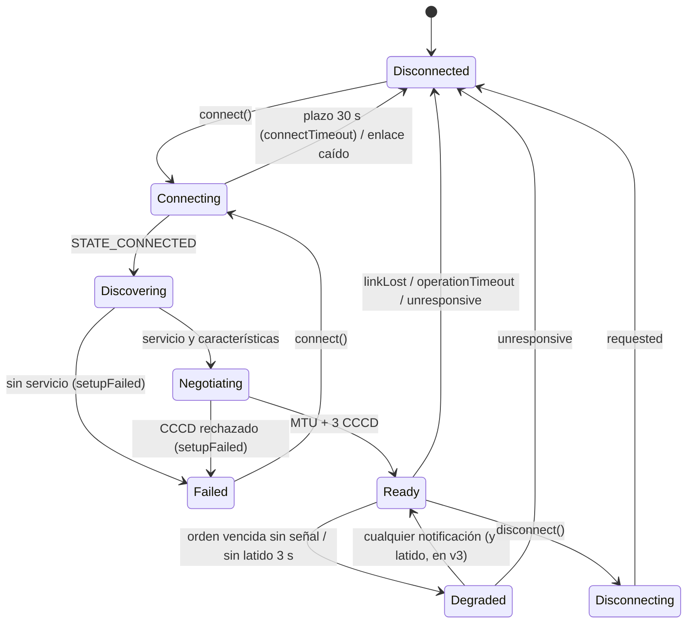

# Cliente BLE de Android (TresVizo Field)

Autor del trabajo: sesión Android-BLE de «Los residentes», 27-09-2026. Estado: **borrador
de las 22:20, actualizado al cierre**. Todo lo que sigue sale del código; nada se probó con un
Meridian ni con un teléfono. **Compilado y con pruebas en verde en la Mac del propietario**
(Android Studio instalado a las 22:22): ver §8.

Rutas abreviadas. En el repositorio Android (`TresVizoFieldAndroid`, rama `los-residentes-chris`):
`core/bluetooth/…` = `android/core/bluetooth/src/main/kotlin/com/tresvizo/field/core/bluetooth/`,
`core/domain/…` = `android/core/domain/src/main/kotlin/com/tresvizo/field/core/domain/`,
`app/…` = `android/app/src/main/kotlin/com/tresvizo/field/`. Las líneas «antes» son de `ec8b6a4`
(la base de la rama). En el firmware (`TresVizoRTK`, rama `los-residentes`): `firmware/esp32/src/…`,
líneas de `3adf6c4` (0.7.11) salvo que se diga otra cosa.

## 1. Piezas y quién es dueño de qué

| Pieza | Archivo | Qué hace | Hilo |
| --- | --- | --- | --- |
| `GattConnector` / `GattLink` / `GattEvent` | `core/bluetooth/gatt/Gatt.kt` | La parte de `BluetoothGatt` que se usa, y nada más; existe para probar el transporte en la JVM | — |
| `AndroidGattConnector` | `core/bluetooth/gatt/AndroidGattConnector.kt` | **Único** archivo que toca `android.bluetooth` en la conexión: `connectGatt(autoConnect=false, TRANSPORT_LE)` (`:49` antes), formas de API 33, `SecurityException` → operación rechazada | callbacks en el hilo binder |
| `BleReceiverTransport` | `core/bluetooth/BleReceiverTransport.kt` | El transporte del Meridian: conexión, cola de órdenes, reensamblado, telemetría, RTCM | un despachador serie propio (`Dispatchers.Default.limitedParallelism(1)`, `AndroidBluetooth.kt:43` antes) |
| `ReceiverTransport` (puerto) | `core/domain/ports/ReceiverTransport.kt` | `request(method, path, body)`, `writeCorrections(frame)`, `solutions`, `health`, `connectionState` | — |
| `TransportRouter` | `core/domain/session/TransportRouter.kt` | Elige BLE o Wi-Fi **por capacidad** para cada orden | el de la sesión |
| `SessionSupervisor` | `core/domain/session/SessionSupervisor.kt` | Vigila los enlaces cada 500 ms, reconecta con escalera 1-2-4-8-16-30 s ±20 %, relee todo al volver | el de la sesión |
| `DeviceSession` | `core/domain/session/DeviceSession.kt` | La sesión del Meridian (equivale a la de iOS) | hilo principal (`ReceiverSessionService.kt:137`) |
| `CorrectionBridge` + `CorrectionBridgeController` | `core/domain/corrections/` | Puente NTRIP → RTCM → equipo: CRC, edad 2 s, cola, contadores, diagnóstico de tres contadores | el de la sesión (principal) |
| `SessionBridgeController` | `feature/corrections/…/SessionBridgeController.kt` | Un puente **por sesión** (`:51-52`); para el de una sesión que se va (`:43-45`) | principal |
| `ReceiverSessionService` | `app/session/ReceiverSessionService.kt` | Servicio en primer plano `connectedDevice` que aloja la sesión (`:134-150`) y la suelta en `onDestroy` (`:211-224`) | principal |

**Un solo dueño de cada característica**: solo `BleReceiverTransport` escribe en `A04C0002`
(órdenes) y `A04C0005` (RTCM), y solo él recibe `A04C0003/4/6`. El puente NTRIP no conoce el
transporte: llama `DeviceSession.writeCorrections` (`core/domain/session/DeviceSession.kt:1121-1127`).

## 2. GATT tal como lo usa la app

- Servicio `A04C0001`, filtro de búsqueda por UUID de servicio (`scan/AndroidBleRadio.kt:74`),
  `BLUETOOTH_SCAN` con `neverForLocation` y `BLUETOOTH_CONNECT` comprobado antes de conectar
  (`gatt/AndroidGattConnector.kt:58-60` antes).
- Preparación, **una operación GATT a la vez**: descubrir → `requestMtu(247)` → CCCD de
  `A04C0003`, `A04C0004`, `A04C0006`, una por una (`BleReceiverTransport.kt:270-312` antes).
  Solo entonces `ready` (iOS no espera las suscripciones: sospecha S9 de la auditoría iOS).
- Trozos de escritura de `MTU − 3` (244 con MTU 247), nunca escrituras largas (Prepare/Execute).
- Órdenes (`A04C0002`): escritura **con respuesta** (`WRITE_TYPE_DEFAULT`).
- RTCM (`A04C0005`): con respuesta hasta 0.7.10; **sin respuesta desde 0.7.11** si la
  característica declara `PROPERTY_WRITE_NO_RESPONSE` (contrato v3; firmware
  `ble_transport.cpp:298`). La app lo lee de las propiedades al descubrir, no de la versión.
- Intervalo de conexión: la app **no** lo fija. Desde 0.7.11 lo pide el equipo, 15–30 ms,
  latencia 0, supervisión 4 s (`ble_transport.cpp:55-58`, `:92-98`). Con firmware anterior
  queda el «balanced» de Android (30–50 ms).

## 3. Ciclo de conexión

- **Identidad de sesión**: cada conexión lleva un número (`linkNumber`); el callback de la
  plataforma se envuelve con el número de su conexión (`BleReceiverTransport.kt:223` antes) y se
  descarta si no es el vigente (`:248` antes). `dropLink` sube el número antes de nada (`:324`
  antes). Además la **generación** (`SessionGeneration`) sube al quedar `ready` y lo que pertenece
  a otra se descarta sin entregar (`:664` antes). **Correcto.**
- **`close()` en cada salida**: `dropLink` cierra (`:353` antes) al caer el enlace (`:251`),
  al vencer el plazo de conexión (`:235-238`), al vencer una operación GATT (`:416-419`), al fallar
  la preparación (`:279`, `:283`, `:299`), al cancelar la conexión (`:203`) y ante una excepción
  inesperada (`:775`). `AndroidGattLink.close()` hace `disconnect()` y `close()`
  (`AndroidGattConnector.kt:156-169` antes). **Correcto.**
- **Reconexión**: la del supervisor, 1-2-4-8-16-30 s con ±20 % y sin límite
  (`SessionSupervisor.kt:250-276`, `ReconnectBackoff.kt`), en su propia corrutina; al volver,
  `handshake()` relee estado, configuración, perfil y operaciones. No hay suscripciones
  duplicadas (cada conexión es un `BluetoothGatt` nuevo) ni tuberías NTRIP duplicadas (un puente
  por sesión). **Correcto.**

## 4. Órdenes (CONTROL)

- Cola del cliente (`ClientQueuePolicy`): una orden en vuelo, lecturas repetidas unidas,
  mutaciones delante, una orden del usuario abandona la lectura en vuelo (`:497-545` antes).
- Correlación por el `id` del JSON, nunca por el contador de la trama (`:671-678` antes).
- Plazo → `Uncertain`, nunca reintento (`:625-630` antes). Hueco en el reensamblado →
  `Uncertain` (`:647-652` antes).
- Cada operación GATT espera su callback con un vigilante de 10 s; si no llega, el enlace se da
  por perdido (`:403-423` antes).
- Una línea se escribe entera aunque su lectura se abandone (`requestLineLock`, `:600-622` antes).

## 5. RTCM (puente del teléfono)

```mermaid
flowchart LR
    C[Caster] -->|TCP/TLS| N[NtripSocketClient]
    N -->|bytes| B[CorrectionBridge.ingest<br/>CRC24Q, tramas enteras<br/>cola 8 KiB]
    B -->|next: edad ≤ 2 s,<br/>fuente ble, sin salida| P[CorrectionBridgeController.pump]
    P -->|CorrectionSink.write| S[DeviceSession.writeCorrections]
    S --> T[BleReceiverTransport.writeCorrections<br/>trozos MTU−3, una operación a la vez]
    T -->|A04C0005 sin respuesta v3<br/>con respuesta v2| E[ESP32: parser RTCM → cola 8 KiB → UART]
    E --> U[UM980]
```

- Una trama empezada se escribe entera (`correctionFrameLock` + `NonCancellable`,
  `:743-757` antes); el RTCM y las órdenes se alternan trozo a trozo por el mismo candado GATT
  (`gattLock`, justo), sin inanición: nunca hay más de un escritor de RTCM y uno de órdenes
  esperando.
- `adbf364` («Cap GNSS to 5 Hz and fix RTCM queue»): subió la cola del teléfono de 4 a
  32 tramas porque el caster manda la época de golpe y `ingest` la encola entera antes de que
  salga la primera; con 4, la quinta echaba a la primera, que era la 1006, y el receptor no
  conocía la base. La edad se mira al enviar, así que la cola larga no mete retraso. **Arreglo
  correcto**; desde el contrato v3 la cola se mide en bytes (8 KiB), no en tramas.
- Al fallar una escritura: la cola se vacía y se sigue con lo nuevo (`CorrectionBridgeController.kt:235-239`
  antes); al dejar de llegar datos del caster, también (`:256-265`). Al reconectar **no se
  reenvía nada viejo**. **Correcto.**

## 6. Hallazgos

D = defecto confirmado en el código; S = sospecha que solo el equipo puede confirmar; B = bien.

| # | Dónde (antes) | Qué |
| --- | --- | --- |
| **D1** | `CorrectionBridgeController.kt:235-239`, `CorrectionBridge.kt:122-125` | **Las cuentas del RTCM no cuadran**: la trama cuya escritura falla y las que `flush()` tira (fallo, parada, caster caído) no se cuentan en ningún sitio; `framesFromCaster ≠ escritas + descartadas + en cola`. |
| **D2** | `BleReceiverTransport.kt:625-630`, `:416-419` | **Sin detección de sesión medio muerta**: con el enlace arriba y el equipo sin contestar, cada orden vence `Uncertain` para siempre; el enlace solo se suelta si falta el callback de una operación GATT. |
| **D3** | `ports/ReceiverTransport.kt:78-85`; `BleReceiverTransport.kt:148-156` | **Sin máquina de estados explícita**: cuatro estados públicos y el resto repartido en `link`, `linkIsUp`, `connectAttempt`, `setup`, `connectDeadline`; sin descubrir/negociar/degradado, y sin distinguir desconexión pedida de inesperada (`dropLink` siempre `Disconnected`). |
| **D4** | `BleReceiverTransport.kt:600-622`; firmware `ble_transport.cpp:112-139` | **Una línea cortada contamina la siguiente**: si falla un trozo que no es el primero, el equipo guarda los anteriores (hasta 5 s) y pega la línea siguiente detrás. Si el trozo fallido solo llevaba el `\n`, el equipo **ejecuta la orden que la app dio por fallida** al llegar la siguiente, y la siguiente se pierde. La orden se informaba `LinkFailure` («no se aplicó»). Probabilidad baja (≈1/244 de las líneas cortadas), consecuencia grave. |
| **D5** | `CorrectionBridge.kt:68-72` antes | Cola del teléfono medida en tramas (32): no dice cuánto tarda en salir; el contrato v3 la pide en bytes. |
| **D6** | `BleReceiverTransport.kt:180` antes | Sin contadores de diagnóstico salvo `malformedResponses`: huecos, huérfanas, plazos, rechazos, cortes y tiempos de escritura de RTCM no se cuentan. |
| **S1** | firmware `ble_transport.cpp:153` (0.7.10), `AndroidGattConnector.kt:146` antes | RTCM con respuesta: cada trozo cuesta al menos un intervalo de conexión y comparte el único carril ATT con las órdenes. Con el «balanced» de Android (30–50 ms) una trama de 1 kB son 5 trozos ≈ 150–250 ms; una época de 2–5 kB/s más órdenes y telemetría puede acercar el enlace a saturación y hacer que el puente tire tramas por edad. **Resuelto por el contrato v3** (sin respuesta + intervalo 15–30 ms pedido por el equipo); medir mañana. |
| **S2** | `AndroidGattConnector.kt`, `SessionSupervisor.kt:250-276` | Bluetooth del teléfono apagado con el enlace arriba: algunos teléfonos no llaman `onConnectionStateChange` y el cliente GATT solo rechaza; el transporte se quedaba `Ready` con órdenes que fallan una tras otra. **Arreglado**: `GattEvent.AdapterOff` (receptor de `ACTION_STATE_CHANGED` por conexión) ⇒ `bluetoothOff`, y tres operaciones rechazadas seguidas ⇒ `linkLost`. Y al volver (`STATE_ON`) la escalera del supervisor se pone a cero (`SessionSupervisor.bluetoothAvailableAgain`, receptor en `ReceiverSessionService`): el siguiente intento sale en ≤ 0,5 s en vez de hasta 30 s. |
| **S3** | `AndroidGattConnector.kt:47-53` antes | `attach(gatt)` después de `connectGatt`: un callback antes de `attach` no usaría el `gatt` del campo (los callbacks usan el que traen) y el transporte procesa los eventos en su despachador después de `beginConnect`. **Sin efecto práctico**; anotado. |
| **B1** | `BleReceiverTransport.kt:403-423` antes | **Todas** las operaciones GATT serializadas (descubrir, MTU, las 3 CCCD, cada trozo de orden y de RTCM), una en vuelo, con vigilante de 10 s. La prueba falsa exige `maxOutstanding == 1`. |
| **B2** | `:221-223`, `:248`, `:324` antes | Callbacks de una conexión vieja descartados por número de conexión. |
| **B3** | `AndroidGattConnector.kt:98-111` antes | Formas de API 33 para notificaciones y escrituras; sin doble entrega de `onCharacteristicChanged`. |
| **B4** | `:288`, `BleRequestChunker` | MTU 247 pedido; trozos `MTU−3`; reensamblado por desplazamiento, sin suponer 20 bytes. |
| **B5** | `CorrectionBridge.kt`, `CorrectionBridgeController.kt` | CRC24Q antes de gastar radio, tramas enteras, edad 2 s al enviar, sin reenviar historia, un puente por sesión. |
| **B6** | `ReceiverSessionService.kt:134-224` | Servicio en primer plano `connectedDevice`; una sesión a la vez; el GATT se cierra al destruir el servicio. |
| **B7** | búsqueda en todo `android/` | Ningún `name.contains("Meridian")`; UUIDs y tramas del Meridian solo en `core/domain/ble` y `core/bluetooth`. |

## 7. Qué cambió (sin tocar el contrato; el v3 lo fija BLE_CONTRACT.md)

| Cambio | Dónde | Pruebas |
| --- | --- | --- |
| **Máquina de estados** `LinkPhase` (`disconnected, connecting, discovering, negotiating, ready, degraded, disconnecting, failed`) con transiciones legales y `DisconnectCause` (`requested, linkLost, connectTimeout, operationTimeout, setupFailed, unresponsive, refused`), nombres acordados con iOS. El transporte publica `linkPhase` y `lastDisconnectCause`; `connectionState` no cambia para no romper a nadie. | `core/domain/session/LinkPhase.kt`; `BleReceiverTransport.kt` | `LinkStateMachineTest` (9), `BleLinkHardeningTest` |
| **Vida del protocolo** sin tráfico nuevo: `ProtocolLiveness`. v2: 2 órdenes vencidas seguidas + 20 s sin nada ⇒ `unresponsive`. v3 (latido de salud a 1 Hz) **solo si** la sesión leyó `protocol_version >= 3` en el estado (`ReceiverTransport.protocolVersionKnown`, llamado desde `DeviceSession.refreshStatus`) y la salud está suscrita — nunca deducido de la tabla GATT: sin salud 3 s ⇒ `degraded` y **una** consulta `GET /api/ble`; si vence sin señal ⇒ `unresponsive`. Se suelta el enlace y reconecta la escalera. | `core/domain/session/ProtocolLiveness.kt`; `BleReceiverTransport.kt` (`judgeLiveness`, `watchHeartbeat`, `askWhetherAlive`, `protocolVersionKnown`) | `ProtocolLivenessTest` (12), `BleLinkHardeningTest` |
| **Carril con las órdenes primero**: `LaneGate` (dos colas sobre la única operación GATT): si una orden o un paso de preparación espera, el siguiente turno es suyo; una línea de orden conserva el carril todos sus trozos; el RTCM toma el resto, una escritura en vuelo. | `core/domain/ble/LaneGate.kt`; `BleReceiverTransport.kt` (`operation`, `writeLine`) | `LaneGateTest` (5), `BleLinkHardeningTest` |
| **Versión 3**: `BleIdentifiers.SUPPORTED_PROTOCOL_VERSION = 3`; el aviso «El equipo habla la versión…» solo con un equipo **más nuevo** (v3 es aditivo). | `core/domain/ble/BleIdentifiers.kt`, `feature/receiver/SystemScreens.kt` | — |
| **RTCM sin respuesta** si `A04C0005` declara `WRITE_NO_RESPONSE` (v3), una escritura en vuelo y la siguiente tras `onCharacteristicWrite`; si no, con respuesta. | `gatt/Gatt.kt`, `gatt/AndroidGattConnector.kt`, `BleReceiverTransport.kt` | `BleLinkHardeningTest` |
| **Línea cortada**: la siguiente empieza con `\n`; la orden cortada queda `Uncertain` (podría ejecutarse) y la respuesta al fragmento no es de nadie. | `BleReceiverTransport.kt` (`writeLine`, `send`) | `BleLinkHardeningTest` |
| **Cuentas del RTCM que cuadran**: `flushedDropped`, `failedWrites`, `bytesWritten` y `Statistics.balances(queued, inFlight)`. | `core/domain/corrections/CorrectionBridge.kt`, `CorrectionBridgeController.kt` | `CorrectionBridgeAccountsTest` (6), `CorrectionBridgeControllerTest` (+1) |
| **Cola del teléfono por bytes**: 8 KiB (igual que la del equipo), tramas enteras, lo más viejo fuera, edad 2 s. | `RtcmBridgePolicy.PHONE_QUEUE_CAPACITY_BYTES`, `CorrectionBridge.kt` | `CorrectionBridgeTest` (actualizada), `CorrectionBridgeAccountsTest` |
| **Salud v3**: bytes 17–19 (bandera `0x04`) como `DeviceRtcmCounters` (módulo 256, `delta`) y ocupación %. | `core/domain/telemetry/HealthPacket.kt` | `HealthPacketRtcmCountersTest` (5) |
| **Contadores ligeros** `LinkDiagnostics` (intentos, listos, cortes inesperados y causa, rechazos, plazos GATT, fallos de escritura, órdenes vencidas, huecos, huérfanas, malformadas, líneas cortadas, RTCM escrito/fallido/bytes, tiempo último y máximo por trama, pico de la cola de órdenes, última señal de vida). | `core/domain/session/LinkDiagnostics.kt`; `BleReceiverTransport.diagnostics` | `LinkStateMachineTest`, `BleLinkHardeningTest` |
| **Bluetooth del teléfono**: apagado con el enlace arriba ⇒ `bluetoothOff` (receptor de `ACTION_STATE_CHANGED` por conexión); tres operaciones GATT rechazadas seguidas ⇒ `linkLost` (teléfonos que no avisan); encendido ⇒ la escalera del supervisor vuelve a 1 s y el siguiente intento sale ya. | `gatt/AndroidGattConnector.kt`, `BleReceiverTransport.kt`, `SessionSupervisor.bluetoothAvailableAgain`, `app/session/ReceiverSessionService.kt` | `BleLinkHardeningTest`, `SessionSupervisorTest` (+1) |
| **Traza DEBUG** sin cuerpos ni credenciales, apagada salvo `adb shell setprop log.tag.TresVizoBle DEBUG`. | `BleTrace` en `BleReceiverTransport.kt`; `AndroidBluetooth.kt` | — |
| **Sumidero de correcciones común** `CorrectionSink` (de la que hereda `GenericCorrectionSink`). | `core/domain/corrections/CorrectionSink.kt` | vía `CorrectionBridgeControllerTest` |
| **Interfaz, como iOS**: Equipo → Bluetooth, «Enlace visto desde el teléfono» (fase, último corte, 6 contadores) releída cada segundo solo en su sección, y el aviso de tabla GATT vieja; Puente, «otras» con lo vaciado y lo no aceptado. | `feature/receiver/SystemScreens.kt`, `feature/corrections/BridgeScreen.kt` | `:feature:receiver` 36, `:feature:corrections` 36 (compilan y pasan; sin prueba propia de la sección) |
| **Tirones de Compose** (A133): barra de estado, tarjeta de posición, panel de captura y barras del replanteo leen el estado rápido abajo; la posición en vivo en su propia capa del mapa. Pendiente: `CapturePanel` aún se rehace entero en cada época con el panel abierto. | `app/shell/AppShell.kt`, `core/ui/map/MapCanvas.kt`, `feature/receiver/ConnectedDeviceScreen.kt`, `feature/survey/ProjectNavigation.kt`, `ProjectScreen.kt`, `feature/stakeout/StakeoutScreen.kt` | compilan; pruebas de esos módulos en verde |

**Descartado**: `requestConnectionPriority(HIGH)` (lo puse y lo quité): fijaría 11,25–15 ms y
pisaría los 15–30 ms que pide el equipo desde 0.7.11.

## 8. Pendiente y qué probar con el equipo

- **Compilado y probado (22:37–22:46)**: `:core:bluetooth:testDebugUnitTest` 87 pruebas, 0 fallos
  (`BleLinkHardeningTest` 20, `BleReceiverTransportTest` 41, `BleDeviceScannerTest` 19,
  `BleSessionTest` 1, `SppReceiverLinkTest` 6); `:core:domain:test` 1049 pruebas, 0 fallos, **con 8
  archivos de prueba ajenos apartados** porque en la base de la rama no compilan (usan el modelo de
  ocupaciones de base que quitó `a9259a6`); `:core:ui`, `:feature:receiver`, `:feature:survey`,
  `:feature:stakeout` y `:app` compilan (`compileDebugKotlin`); pruebas de pantallas y de la app sin
  fallos: `:core:ui` 59, `:feature:receiver` 36, `:feature:stakeout` 17, `:feature:corrections` 36,
  `:app` 116, `:feature:survey` 61 (con dos archivos ajenos apartados por la misma rotura). No se
  instaló en ningún teléfono.
  Prueba final de todo (22:58): además `:core:network` 76, `:feature:files` 15, `:feature:settings`
  8 y `:app` 116, sin fallos; `:core:storage` no compila sus pruebas en la base
  (`SurveyStoreSqliteTests.kt`, la misma rotura del desfase de base), ajeno a este trabajo.
  Commits en `los-residentes-chris`: `2aafec8`, `babd21c`, `5bee488`, `13ac36b`, `7394b16`,
  `718fb77`, `db682e1`, `8303c34`, `1212774`, `f45c35a`, `cbc700a`, `b313e72`.
- Con un Meridian 0.7.11 y un teléfono Android: (1) conectar y ver en la traza (`setprop`)
  `corrections without response true`; (2) puente NTRIP 10 min con `CorrectionBridge.Statistics`
  y `/api/status → subsystems.gnss` a la vista: `balances()` siempre verdadero, `failedWrites` 0,
  `staleDropped` 0, `correction_frames_evicted/expired` sin subir; (3) mientras corre el puente,
  órdenes del usuario (cambiar fuente, leer perfil): ninguna vence; (4) tapar la antena del
  equipo (sin fix): el enlace debe seguir `ready` gracias al latido; (5) desconectar el UM980 no
  debe tumbar el enlace; (6) apagar el ESP32 con el teléfono conectado: `linkLost` en ≤ 4 s
  (supervisión); (7) reiniciar el ESP32 a mitad del puente: al volver, nada viejo sale;
  (8) Bluetooth del teléfono apagado/encendido: anotar cuánto tarda en volver (S2).
- La interfaz enseña la fase, el último corte y los contadores en Equipo → Bluetooth, sección
  «Enlace visto desde el teléfono», con los textos de iOS (`8303c34`); falta verlo en un teléfono.
