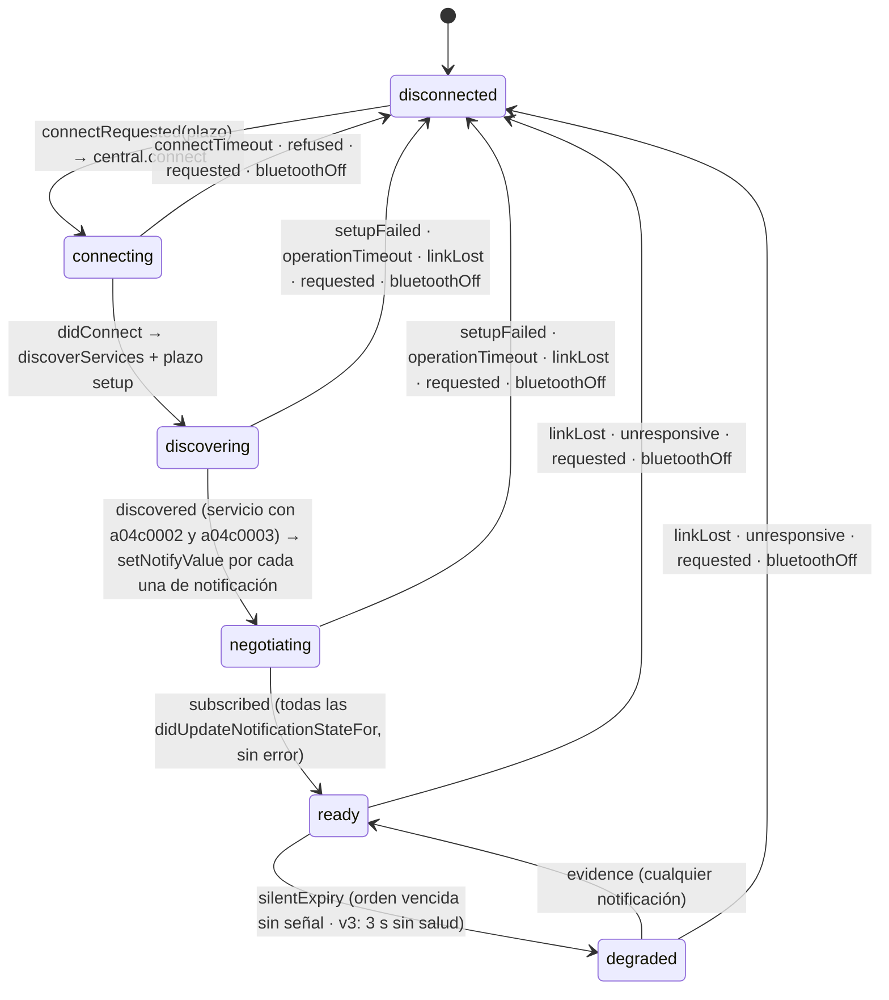
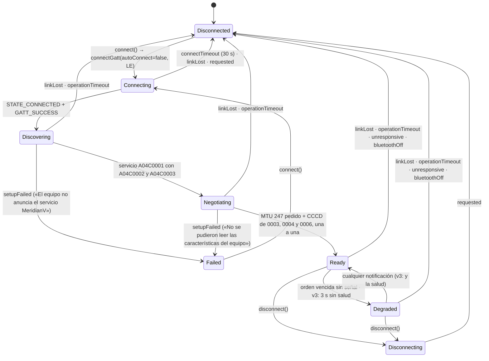

# Máquina de estados de la conexión BLE del Meridian V

Dos secciones, una por app, con los **mismos nombres** (acordados el 27-09-2026 entre las dos
apps): `LinkPhase`, `DisconnectCause`, `ProtocolLiveness`. Lo que difiere entre las dos
está dicho en cada sección con su motivo de plataforma. «Reconectando» no es una fase del enlace:
es de la sesión (`SessionState.reconnecting(attempt)`), que reintenta con la escalera
1-2-4-8-16-30 s ±20 %.

## iOS

Código (rama `los-residentes-jill` del repo iOS, hasta `7332b4f`). Rutas abreviadas: `Core/` =
`TresVizo Field/Packages/MeridianVCore/Sources/MeridianVCore/`, `App/` =
`TresVizo Field/TresVizo Field/`.

- `Core/BLE/BLELinkMachine.swift`: `LinkPhase` (l. 22), `DisconnectCause` (l. 60), `LinkTimeouts`
  (l. 97) y la máquina `BLELinkMachine` (l. 134), **pura y sin CoreBluetooth**: recibe eventos y
  devuelve acciones. Pruebas: `BLELinkMachineTests` (17) en `Tests/MeridianVCoreTests/BLELinkTests.swift`.
- `Core/BLE/ProtocolLiveness.swift`: vida del protocolo y latido (`ProtocolLivenessTests` 5,
  `HeartbeatTests` 8, en el mismo archivo de pruebas).
- `App/Data/BLETransport.swift`: ejecuta las acciones con CoreBluetooth (`apply`, l. 211) y es el
  delegado del periférico. `App/Data/DeviceDiscovery.swift`: dueño del `CBCentralManager`, le pasa
  `didConnect` / `didDisconnectPeripheral` / `didFailToConnect` (l. 242-263) y el apagado de la
  radio (l. 212). `App/Session/DeviceSession.swift`: decide **cuándo** volver a intentar.

Estado: compila y el núcleo pasa `swift test` (676 pruebas, 1 omitida que no tiene que ver).
**Nada de esto se ha probado contra el Meridian por Bluetooth**: queda para el propietario.

### Transiciones legales

Todas en `BLELinkMachine.handle` (l. 200-295). Lo que no está en la tabla **no cambia la fase**: se
ignora y suma `ignoredLateEvents`, que la interfaz enseña como «Avisos tardíos descartados».

| Evento | Desde | Hacia | Acciones |
| --- | --- | --- | --- |
| `connectRequested(timeout:)` | `disconnected` | `connecting` | el intento sube (`attempt`), `lastCause` a nulo; `central.connect`; plazo `connect` si hay |
| `connectRequested` | cualquier otra | — | nada: quien pide **se une** al intento en curso (`BLETransport.connect`, l. 195, guarda su continuación en `connectWaiters`) |
| `didConnect` | `connecting` | `discovering` | `discoverServices([a04c0001])`; plazo `setup` |
| `didConnect` | `disconnected` | — | `cancelPeripheralConnection`: la conexión llegó cuando ya nadie la quería; cuenta como tardío |
| `discovered` | `discovering` | `negotiating` | se piden las suscripciones (el transporte, l. 783-788) |
| `subscribed` | `negotiating` | `ready` | `becameReady`: sube la generación, `ProtocolLiveness.reset`, arranca la vigilancia del latido, despierta a quien esperaba y suelta la cola de órdenes |
| `setupFailed` | `discovering`, `negotiating` | `disconnected` | cancelar, despertar con error, invalidar |
| `didFailToConnect` | `connecting` | `disconnected` | causa `refused`; despertar con error, invalidar |
| `didDisconnect` | `discovering` … `degraded` | `disconnected` | causa `linkLost`; invalidar |
| `didDisconnect` | `connecting` | — | **de la conexión anterior**: se ignora y se cuenta (el intento en curso no ha recibido `didConnect`, no tiene nada que desconectar) |
| `didDisconnect` | `disconnected` | — | eco de un corte ya dado por hecho; ni se cuenta |
| `disconnectRequested` | cualquiera con intento o enlace | `disconnected` | causa `requested`; cancelar; invalidar |
| `bluetoothOff` | cualquiera salvo `disconnected` | `disconnected` | causa `bluetoothOff`; **sin** llamar a CoreBluetooth (fuera de `poweredOn` lo rechaza) |
| `timeoutFired(attempt, scope)` | la fase que vigila | `disconnected` | `connect` en `connecting` ⇒ `connectTimeout`; `setup` en `discovering`/`negotiating` ⇒ `operationTimeout`. De otro intento ⇒ ignorado y contado; del intento vigente pero ya pasado de fase ⇒ nada |
| `silentExpiry` | `ready` | `degraded` | — |
| `evidence` | `degraded` | `ready` | — |
| `unresponsive` | `ready`, `degraded` | `disconnected` | causa `unresponsive`; cancelar; invalidar |

Una causa `setupFailed` deja al transporte en `.failed(reason: "El equipo no anuncia el servicio
MeridianV completo")` (`BLETransport.syncState`, l. 266); cualquier otra, en `.disconnected`. `ready` y
`degraded` son las dos «usables» (`LinkPhase.isUsable`): las órdenes y el RTCM siguen saliendo en
`degraded` mientras se decide si el equipo contesta.

### Plazos con nombre

| Nombre | Valor | Dónde | Qué vigila |
| --- | --- | --- | --- |
| `LinkTimeouts.connect` | 12 s | `BLELinkMachine.swift:110` | Solo la **primera** conexión de la sesión (`DeviceSession.openLinks`, l. 294): la que el usuario mira, y Wi-Fi espera detrás. Al reconectar **no hay plazo** a propósito: la conexión pendiente se deja abierta e iOS la completa en cuanto el equipo vuelve a anunciarse |
| `LinkTimeouts.setup` | 8 s | `BLELinkMachine.swift:116` | Descubrir el servicio y sus características y confirmar las suscripciones |
| `ProtocolLimits.defaultRequestTimeout` | 8 s | `Core/Protocol/ProtocolLimits.swift:43` | Cada orden. Cuenta desde que sus trozos se entregan a CoreBluetooth (`pumpQueue`, l. 477); como el RTCM tiene como mucho un trozo en la pila, eso es a lo sumo una ida y vuelta ATT después de salir |
| `ProtocolLiveness.heartbeatMissingAfter` | 3 s | `ProtocolLiveness.swift:51` | Con protocolo ≥ 3 **y** la característica de salud descubierta y suscrita (`setProtocolVersion`, l. 665): 3 s sin salud ⇒ `degraded` y **una** orden `GET /api/ble`; si vence sin ninguna señal del equipo ⇒ `unresponsive`. Se mira cada `heartbeatCheckInterval` = 1 s (l. 105). Si la orden contesta y la salud sigue sin llegar, no se vuelve a preguntar hasta pasados `unresponsiveSilence` |
| `ProtocolLiveness.unresponsiveExpiries` y `unresponsiveSilence` | 2 y 20 s | `ProtocolLiveness.swift:34, 42` | Sin latido (v2 o tabla GATT vieja): dos órdenes vencidas seguidas sin señal **y** 20 s sin nada del equipo ⇒ `unresponsive` |
| `RTCMBridgePolicy.writeStallTimeout` | 2 s | `Core/Corrections/RTCMBridgePolicy.swift:48` | Un trozo RTCM sin acuse (con respuesta) o sin hueco en la pila (sin respuesta): la trama cuenta como fallida. Es igual a `parserIdleReset`, el reinicio del parser del ESP32, para que abandonar una trama a medias no parta la siguiente |

### Reintentos

- **El enlace no reintenta nada**: cierra con su causa. Reintenta la sesión (`DeviceSession.superviseLinks`,
  l. 407), cada `superviseInterval` = 500 ms (l. 168), con `ReconnectBackoff` 1-2-4-8-16-30 s ±20 %
  (`Core/Session/ReconnectBackoff.swift:9, 12`). Mientras la conexión pendiente sigue abierta no se
  abre otra (una sola tarea `bluetoothReconnect`); la escalera solo espacia los intentos que fallan de
  verdad (`refused`, `setupFailed`, `operationTimeout`, o la radio apagada, que hace fallar
  `connect` al instante). El éxito la reinicia.
- Tras reconectar, `handshake` (l. 356) **relee todo**: estado, configuración, perfil, operaciones y
  trabajo. La versión del protocolo leída decide otra vez si se espera latido.
- **Las órdenes no se repiten nunca solas**: las pendientes al cortarse quedan `uncertain` y se
  consulta el estado. Tampoco se reenvía RTCM: la trama en vuelo falla y el puente vacía su cola
  (`CorrectionBridgeController.swift:151-152`).
- Wi-Fi tiene su propia escalera y no espera a Bluetooth: si caen los dos, la sesión pasa a
  `reconnecting(attempt)`.

### Limpieza al cerrar (`invalidateEverything`, `BLETransport.swift:285`)

Se cancela el plazo del enlace, la vigilancia del latido y su orden; se tiran el reensamblador de
respuestas, el medidor de frecuencia, la última solución y la última salud, las características
descubiertas, las suscripciones pendientes, el redescubrimiento en curso y las lecturas abandonadas;
el libro de acuses RTCM vuelve a cero, la escritura RTCM en vuelo y la espera de hueco fallan, y
cada orden pendiente o en cola se resuelve **incierta** (nunca fallida: pudo aplicarse). Se cuenta
el cierre por su causa (`BLELinkCounters.recordClose`).

### Identidad de sesión y callbacks tardíos

- **Cada intento lleva número** (`attempt`) y cada plazo lo lleva consigo: uno de un intento viejo
  no hace nada.
- **Un `didDisconnect` en `connecting` es de la conexión anterior** (probado en
  `testLateDisconnectOfPreviousConnectionDoesNotFailNewAttempt`).
- La **generación** sube en cada `ready`; una respuesta cuya orden es de otra generación no se
  entrega (`deliver`, l. 883).
- Todo callback del periférico comprueba que es **este** periférico (`peripheral === self.peripheral`)
  y su fase: las notificaciones solo cuentan en `negotiating` o usable (l. 817), las suscripciones
  solo en `negotiating` (l. 802).
- Los avisos del gestor central entran al actor principal **sin saltar de tarea**
  (`MainActor.assumeIsolated`, `DeviceDiscovery.swift:205-263`), para que no los adelanten los del
  periférico, que llegan directos.

### Bluetooth del teléfono apagado

iOS **no** llama `didDisconnectPeripheral` al apagar la radio: `centralManagerDidUpdateState`
(`DeviceDiscovery.swift:212`) avisa a cada transporte (`handleBluetoothUnavailable`) y el enlace cierra
con `bluetoothOff`. Al volver `poweredOn`, se piden de nuevo los periféricos por identificador y se
entregan a los transportes cerrados (`refreshPeripherals`, l. 267, y `adopt`), y el supervisor
reconecta.

### Tabla GATT vieja en caché

- Para llegar a `ready` solo se exigen `a04c0002` y `a04c0003` (`BLETransport.swift:775`); se suscribe
  a las de notificación que existan. Sin la de salud no hay latido y la vida se juzga como en v2.
- El RTCM va sin respuesta solo si `a04c0005` **anuncia** `writeWithoutResponse` en las propiedades
  descubiertas; si no, con respuesta y un trozo en vuelo.
- `peripheral(_:didModifyServices:)` (l. 794) vuelve a descubrir y suscribe **solo lo que no esté ya
  notificando**: no duplica suscripciones.
- El diagnóstico lo dice: Equipo › Bluetooth enseña «Tabla Bluetooth desactualizada…» si el equipo
  declara protocolo ≥ 3 y el teléfono no ve la característica de salud.

### Diferencias con Android, por plataforma

- iOS **no tiene `disconnecting`** ni **`failed(reason)`** como fases: CoreBluetooth da el periférico
  por desconectado al llamar `cancelPeripheralConnection`, y el fallo es `disconnected` +
  `lastCause`.
- iOS no pide MTU: lo negocia el sistema; `negotiating` es esperar la confirmación de las
  suscripciones. Los trozos son de `maximumWriteValueLength(for: .withoutResponse)` (MTU − 3), no del
  valor `.withResponse`, que en iOS es 512 y haría escrituras largas.
- iOS solo pone plazo a la primera conexión; Android a todas (30 s).
- iOS no serializa las suscripciones (CoreBluetooth las encola), pero no da el enlace por listo hasta
  tener todas las confirmaciones.
- El apagado de la radio llega por el estado del gestor central; Android escucha `ACTION_STATE_CHANGED`
  y además cuenta operaciones GATT rechazadas.

## Android

Código: `core/domain/session/LinkPhase.kt` (fases, causas y transiciones legales, Kotlin puro,
`LinkStateMachineTest`), `core/domain/session/ProtocolLiveness.kt` (`ProtocolLivenessTest`) y
`core/bluetooth/BleReceiverTransport.kt`, que publica `linkPhase` y `lastDisconnectCause`
(`BleLinkHardeningTest`). Integrado en `los-residentes`: compila y `:core:bluetooth` pasa sus 87 pruebas.

### Transiciones y plazos con nombre

| Desde | Hacia | Qué la dispara | Plazo (nombre) | Limpieza |
| --- | --- | --- | --- | --- |
| `disconnected`, `failed` | `connecting` | `connect()` | — | nuevo número de conexión (`linkNumber`) |
| `connecting` | `discovering` | `onConnectionStateChange(CONNECTED, GATT_SUCCESS)` | `BleTimeouts.connect` = 30 s | — |
| `discovering` | `negotiating` | `onServicesDiscovered` con las dos características obligatorias | `BleTimeouts.gattOperation` = 10 s por operación | — |
| `negotiating` | `ready` | `onMtuChanged` + tres `onDescriptorWrite` correctos, uno a uno | 10 s por operación | la generación sube; `ProtocolLiveness.reset` |
| `ready` | `degraded` | una orden vence sin señal detrás; con v3, 3 s sin salud | `ProtocolLimits.DEFAULT_REQUEST_TIMEOUT` = 8 s; `ProtocolLiveness.HEARTBEAT_MISSING_AFTER` = 3 s | con v3 sale **una** orden `GET /api/ble` |
| `degraded` | `ready` | cualquier notificación (con v3, y que vuelva la salud) | — | — |
| cualquiera con enlace | `disconnecting` | `disconnect()` | — | — |
| cualquiera | `disconnected` / `failed` | `dropLink(causa)` | — | `close()` del `BluetoothGatt`; órdenes pendientes `Uncertain`; reensamblador, medidor de ritmo, telemetría en caché, MTU y lecturas abandonadas a cero; vigilantes cancelados |

`dropLink` es la **única** salida y es legal desde cualquier fase; una transición que no está en
la tabla no se aplica y se cuenta (`LinkDiagnostics.illegalTransitions`, debe quedar en 0).

### Causas del corte (`DisconnectCause`)

| Causa | Cuándo en Android | ¿Reintenta la sesión? |
| --- | --- | --- |
| `requested` | `disconnect()`; o quien esperaba `connect()` lo canceló | no (es lo pedido) |
| `linkLost` | `onConnectionStateChange` a desconectado (fuera de alcance, equipo reiniciado, supervisión de 4 s vencida); tres operaciones GATT rechazadas al instante seguidas (`REFUSALS_BEFORE_LINK_LOST`: con todo en serie Android nunca está ocupado, así que es un cliente que ya no admite nada); también un defecto inesperado del transporte | sí |
| `connectTimeout` | 30 s sin `STATE_CONNECTED` | sí |
| `operationTimeout` | una operación GATT sin su callback en 10 s: la cola de la plataforma está atascada | sí |
| `setupFailed` | sin servicio o sin características; una CCCD rechazada | sí (con el texto de iOS en la fase `failed`) |
| `unresponsive` | v2: dos órdenes vencidas seguidas y 20 s sin nada (`UNRESPONSIVE_EXPIRIES`, `UNRESPONSIVE_SILENCE`); v3: sin salud 3 s **y** la orden que preguntó venció | sí |
| `refused` | `connectGatt` rechazado al instante: Bluetooth apagado, sin `BLUETOOTH_CONNECT`, dirección inválida | sí |
| `bluetoothOff` | `BluetoothAdapter.ACTION_STATE_CHANGED` a `STATE_TURNING_OFF`/`STATE_OFF` con el enlace arriba (receptor registrado por conexión en `AndroidGattLink`, dado de baja en `close()`) | sí: al volver el Bluetooth (`STATE_ON`) el servicio de la sesión pone la escalera a cero y el siguiente intento sale en el siguiente paso del supervisor (`SessionSupervisor.bluetoothAvailableAgain`) |

### Identidad de sesión y callbacks tardíos

Cada `connectGatt` recibe un `GattEvents` que lleva el número de su conexión; el transporte
descarta todo evento cuyo número no es el vigente (`handle`), y `dropLink` sube el número
**antes** de cerrar. Un `onConnectionStateChange` o una notificación de un `BluetoothGatt` viejo
no toca la conexión nueva (prueba: «a late callback of a closed link never touches the new one»).
Todo plazo (conexión, operación, vida del protocolo, latido) lleva el número de su conexión y no
actúa sobre otra.

### Diferencias con iOS, por plataforma

- Android **sí** tiene `disconnecting` y `failed(reason)` como fases: `close()` no tiene
  callback y la fase dice que la app ya soltó; iOS pasa directo a `disconnected` porque
  CoreBluetooth da el periférico por desconectado al llamar `cancelPeripheralConnection`.
- Android pone plazo a **todas** las conexiones (30 s): `connectGatt(autoConnect=false)` sin plazo
  depende del fabricante; iOS deja sin plazo la reconexión para volver al instante al alcance.
- Android serializa **todas** las operaciones GATT (una en vuelo por conexión) con un carril que da
  el turno a las órdenes antes que al RTCM (`LaneGate`); iOS no necesita serializar las
  suscripciones.
- El MTU lo pide Android (`requestMtu(247)`); iOS lo negocia solo.

### Pendiente en Android

- La fase se ve en Equipo → Bluetooth, sección «Enlace visto desde el teléfono» (como iOS
  `7332b4f`), releída cada segundo; la barra de estado y el banner de la sesión siguen hablando de
  la sesión (`SessionState`), no del enlace.
