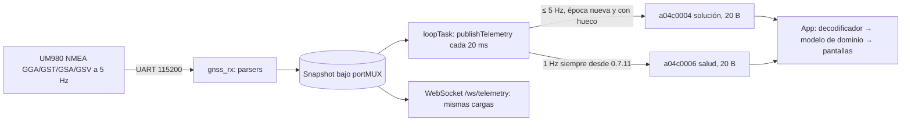
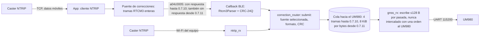

# Arquitectura actual del enlace Meridian V ↔ teléfono

Levantada del código el 27-09-2026 (firmware 0.7.10 → 0.7.11 en `los-residentes`; apps en
`main` de ese día). El detalle de cada app está en [IOS_BLE_ARCHITECTURE.md](IOS_BLE_ARCHITECTURE.md)
y [ANDROID_BLE_ARCHITECTURE.md](ANDROID_BLE_ARCHITECTURE.md). Aquí va el sistema entero y
el lado del equipo, con archivo y línea.

## Piezas del equipo

| Pieza | Dónde | Tarea / contexto | Prioridad |
| --- | --- | --- | --- |
| Bucle principal: consola USB, **BLE (órdenes, respuestas, telemetría)**, armado de la telemetría WebSocket (desde 0.7.13 el envío lo hace la tarea `httpd` con `httpd_queue_work`), `instrument::tick` | `src/main.cpp:235-250` | `loopTask` (Arduino) | 1 |
| Callbacks de escritura BLE (órdenes y RTCM) | `src/ble_transport.cpp` `CommandCallbacks`, `CorrectionCallbacks` | tarea de Bluedroid (BTC) | la de la pila |
| Lectura de la UART del UM980, parsers NMEA, **escritura de RTCM a la UART**, órdenes de configuración al UM980 | `src/gnss_receiver.cpp` `acquire` | `gnss_rx`, 8 KiB de pila | 2 |
| Cliente NTRIP del propio equipo (Wi-Fi) | `src/ntrip_input.cpp` | `ntrip_rx` | 1 |
| Salida de correcciones en modo base | `src/correction_output.cpp` | `rtcm_out` | 1 |
| Grabación microSD (búfer de flujo sin bloqueo) | `src/sd_recorder.cpp` | `sd_writer` | 1 |
| Órbitas y visibles | `src/gnss_visible.cpp` | `orbits` | 1 |
| Servidor HTTP y WebSocket | `src/main.cpp`, `src/telemetry_ws.cpp` | `httpd` | la de ESP-IDF |

Un solo mutex (`instrumentMutex`, `main.cpp:24`) serializa toda orden al instrumento, venga
de USB, HTTP o BLE (`dispatch`, `main.cpp:36-45`, espera hasta 1 s y contesta 503).

UART al UM980: **115200 baudios** (`platformio.ini`), ≈11.5 kB/s por sentido. Recepción con
búfer de 8 KiB en el controlador (`gnss_receiver.cpp`, `setRxBufferSize(8192)`).

## A. Órdenes (control)

```mermaid
sequenceDiagram
    participant App
    participant ATT as ATT (a04c0002, escritura con respuesta)
    participant CB as Callback BLE (tarea BTC)
    participant Loop as loopTask: ble_transport::tick
    participant Inst as instrument::request (bajo instrumentMutex)
    participant UM as UM980 (vía gnss_control, tarea gnss_rx)
    App->>ATT: JSON {id, method, path, body} + LF, en trozos de MTU−3
    ATT-->>App: respuesta ATT (la manda la biblioteca ANTES de onWrite)
    ATT->>CB: onWrite: acumula hasta LF (máx. 1024 B, vence a 5 s)
    CB->>Loop: cola FreeRTOS de 2 peticiones (se tira la 3.ª y se cuenta)
    Loop->>Inst: dispatch (espera el mutex hasta 1 s)
    Inst-->>UM: trabajos GNSS asíncronos (job_id), nunca bloqueantes
    Inst-->>Loop: {id, status, body} ≤ 4096 B
    Loop-->>App: notificaciones a04c0003 del tamaño del MTU (id, offset, flags)
```

- Correlación: el `id` de la petición vuelve en la respuesta y el `messageId` de las tramas
  agrupa los trozos. **Sin deduplicación**: repetir una mutación la ejecuta dos veces.
- Cambio de conexión = nueva generación: peticiones y respuestas de la conexión anterior se
  tiran (`ble_transport.cpp`, `generation`).
- Una respuesta sale a trozos, uno por pasada del bucle, y solo con hueco en la controladora;
  si no hay hueco en 50 ms se manda igual y se cuenta (`response_frames_forced`).

## B. Telemetría



- **Solución**: secuencia, calidad GGA, usados, hora UTC del día (ms, sin fecha), lat/lon ×10⁷,
  altura MSL del receptor en mm. Sale solo con época nueva de menos de 500 ms y a 5 Hz como
  mucho. Instante de medición = hora UTC de la época; instante de llegada al ESP32 =
  `arrival_us` (no viaja); instante de llegada al teléfono = reloj monotónico de la app.
- **Salud** (hasta 0.7.10): **solo detrás de una solución nueva** (`ble_transport.cpp:233`
  retornaba antes de `:255`). Sin fix o sin hora UTC no salía nada: ni edad de correcciones ni
  señal de vida. Corregido en 0.7.11.

## C. Correcciones RTCM



- Una sola fuente activa (`correction_router`), con generación: al cambiar de fuente lo
  encolado de la anterior se tira. Cambiar de fuente con NTRIP activo lo rechaza el equipo
  (409 «Detén NTRIP y espera al GPS antes de cambiar fuente.», medido hoy).
- En modo base, el RTCM que llega por BLE se ignora (`correction_output::active()`).
- Mientras una orden de configuración al UM980 está en curso (`gnss_control::busy()`) no se
  empieza otra trama RTCM: se esperan en la cola (y caducan a los 2 s).

## Lo que se encontró (resumen; detalle en FINAL_REPORT.md)

| # | Hallazgo | Evidencia | Estado |
| --- | --- | --- | --- |
| 1 | RTCM y órdenes comparten el único carril de escritura con respuesta de ATT; la respuesta ATT no confirma nada (se manda antes de `onWrite`) | `ble_transport.cpp:146,153` (0.7.10); `BLECharacteristic.cpp:303-322` de Arduino | Arreglado en 0.7.11 (`WRITE_NR` aditivo) |
| 2 | RTCM con respuesta topa en ≈2.8 kB/s; órdenes +50 % de latencia con RTCM | Medido con la Mac como central, ver ACCEPTANCE_TESTS.md | Explica la inestabilidad con casters pesados |
| 3 | iOS entrega todo el RTCM a CoreBluetooth sin esperar confirmación: cola interna sin límite, órdenes detrás | `BLETransport.swift:333-348` (auditoría del cliente iOS) | Arreglado en la app iOS |
| 4 | Cola hacia el UM980 de 4 tramas: una época MSM de 6-10 tramas que llega de golpe perdía tramas | `gnss_receiver.cpp` (0.7.10) | Arreglado en 0.7.11 |
| 5 | Salud solo detrás de una solución nueva | `ble_transport.cpp:233` (0.7.10) | Arreglado en 0.7.11 |
| 6 | Tabla GATT vieja en caché del cliente (sin emparejamiento no le llega «servicios cambiados») | Mac con 4 de 5 características y sin `WRITE_NR` tras cargar 0.7.11 | Mitigado en las apps; sin arreglo en el equipo todavía |
