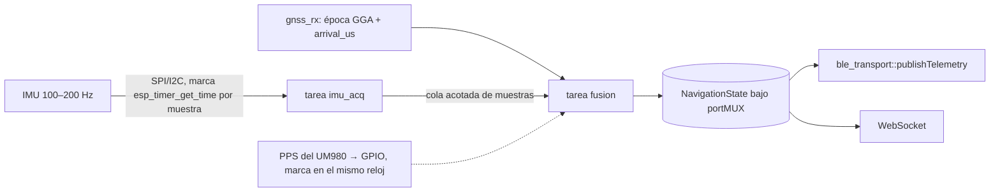

# Preparación para la IMU

Hoy **no hay IMU ni fusión**, y no se implementa nada de ellas. Lo que sigue dice cómo entra la
IMU sin rehacer el Bluetooth, el protocolo ni el transporte de las apps, y qué del estado actual
lo permite o lo estorba. No se afirma que la fusión vaya a dar precisión topográfica: eso pide
ensayos propios (AGENTS.md del firmware).

## Principio

La IMU es **otra fuente** en el equipo y **otro tipo de mensaje** en el enlace. La fusión corre
en el ESP32; al teléfono le llega el estado útil (inclinación, estado de calibración, punta del
bastón corregida) a ritmo de pantalla, y los crudos solo en un modo de diagnóstico que se pide.

## En el equipo

- **Un solo reloj para sincronizar: el monotónico del ESP32** (`esp_timer_get_time`, µs). Cada
  muestra IMU se marca al leerla; cada época GNSS ya trae `arrival_us` (marca de llegada del
  bloque de UART, **no** de medición) y su hora UTC del día. Para alinear bien hace falta el PPS
  del UM980 en un GPIO con interrupción, marcado en el mismo reloj: convierte la hora UTC de la
  época en tiempo del ESP32. **Antes de depender del PPS hay que medir su latencia** (AGENTS.md).
  Nunca se sincroniza con la hora de llegada al teléfono.
- El patrón ya está: una tarea por fuente, instantánea bajo `portMUX`, y un publicador que lee
  la instantánea. La IMU repite el patrón de `gnss_rx` → `gnss_receiver::snapshot()`.
- El publicador de telemetría (`publishTelemetry` en `ble_transport.cpp`, 0.7.11) ya manda
  **solo con hueco** en la controladora y **detrás de las respuestas**, y salta épocas en vez de
  encolarlas: un mensaje de navegación entra ahí con la misma regla, sin tocar órdenes ni RTCM.
- El RTCM no se mezcla: tiene su característica, su rearmado y su cola hacia la UART.

## En el enlace (aditivo, sin romper v3)

| Qué | Cómo | Ritmo |
| --- | --- | --- |
| Estado de navegación fusionado (inclinación, rumbo si lo hay, punta del bastón, calidad de la fusión, estado de calibración) | Característica nueva **`a04c0007`** (sube `kGattTableGeneration`, `ble_address.h`, para que ningún teléfono se quede con la tabla sin ella), notify, paquete propio con **byte de versión**, secuencia, tiempo del ESP32 (ms) y hora UTC de la época GNSS | 5 Hz, como la solución |
| Estado de la IMU en la salud | Byte 9 de la salud (hoy «IMU: reservado, 0») pasa a estado de la IMU con un bit nuevo en el byte 16 | 1 Hz |
| Crudos de diagnóstico | Característica **`a04c0008`**, notify, **apagada por defecto**; se enciende con una orden y se apaga sola al desconectar; lotes de muestras con su tiempo del ESP32 | lo que quepa, nunca en operación normal |
| Capacidad | `imu_available`, `tilt_compensation` en el estado BLE y en `/api/capabilities` | — |
| WebSocket | Tipo de trama nuevo (`0x03` navegación), igual que `0x01` solución y `0x02` salud | igual que BLE |

Presupuesto medido hoy: órdenes y RTCM van del teléfono al equipo; la telemetría del equipo al
teléfono son hoy 5×20 + 20 = 120 B/s. Un estado de navegación de ~40 B a 5 Hz son 200 B/s: sobra
margen incluso con conexión a 30 ms. Los crudos a 200 Hz (≈2.4 kB/s más cabeceras) caben en
diagnóstico, pero **no** se mandan en operación normal: por eso van aparte y apagados.

## En las apps

- El transporte enruta por característica a un **decodificador** y el decodificador entrega un
  tipo de dominio (`SolutionPacket`, `HealthPacket` hoy). La IMU añade `NavigationPacket` →
  `NavigationState` sin tocar el transporte ni las pantallas que no lo usen. Las pantallas leen
  el dominio, nunca características (ver IOS_BLE_ARCHITECTURE.md y ANDROID_BLE_ARCHITECTURE.md).
- Una característica que no se descubre (tabla en caché, firmware viejo) deja la función apagada,
  no la sesión rota (BLE_CONTRACT.md, regla 4).

## Lo que falta decidir cuando llegue el hardware

Modelo y bus de la IMU, frecuencia real, si el PPS del UM980 está cableado a un GPIO, formato
exacto de `a04c0007` y qué calidad de fusión se enseña al usuario. Nada de eso se fija hoy.
