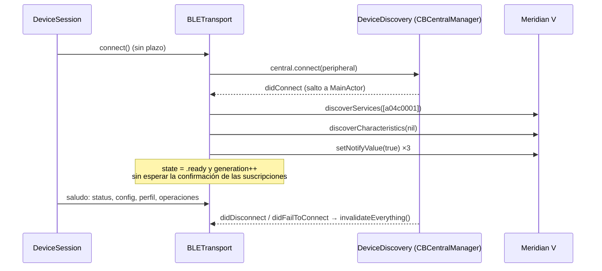
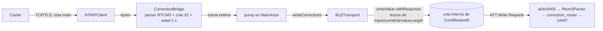
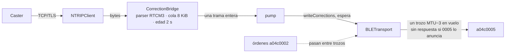

# Cliente BLE de iOS (TresVizo Field)

**Estado:** secciones 1-7, auditoría del código de antes (27-09-2026 22:02 CST); sección 8, lo que quedó después de los cambios (22:45 CST).
Solo hechos leídos en el código de la rama `los-residentes-jill` (worktree
`~/Documents/Residentes/ios-jill`, base `f57f17f`). Nada de esto se ha probado contra el
Meridian V por Bluetooth: no hay equipo conectado hoy.

Rutas abreviadas: `App/` = `TresVizo Field/TresVizo Field/`, `Core/` =
`TresVizo Field/Packages/MeridianVCore/Sources/MeridianVCore/`, `FW/` = `firmware/esp32/`.

## 1. Piezas y quién es dueño de qué

| Pieza | Archivo | Qué hace |
| --- | --- | --- |
| `DeviceDiscovery` | `App/Data/DeviceDiscovery.swift` | Dueño **único** del `CBCentralManager` (cola principal, `queue: nil`, l. 94). Escanea filtrando por el UUID del servicio (l. 106), crea un `BLETransport` por periférico (l. 265) y le reenvía `didConnect`, `didDisconnect` y `didFailToConnect` (l. 225-246) |
| `BLETransport` | `App/Data/BLETransport.swift` | Delegado del `CBPeripheral`. Cola de órdenes (una en vuelo), reensamblado de respuestas, telemetría empujada y escritura de RTCM. Es `@MainActor` |
| `DeviceSession` | `App/Session/DeviceSession.swift` | Elige transporte por capacidad, saludo de cuatro lecturas, supervisor de enlaces con reconexión 1-2-4-8-16-30 s, sondeo de estado por BLE cada 30 s |
| `CorrectionBridgeController` | `App/Session/CorrectionBridgeController.swift` | Puente NTRIP → BLE: cliente NTRIP, cola, bombeo y diagnóstico de tres contadores |
| Núcleo puro | `Core/BLE/*`, `Core/Corrections/*`, `Core/Session/*` | Troceado, reensamblado, política de cola de órdenes, parser RTCM3, política del puente, escalera de reconexión, generación de sesión. Con pruebas XCTest |

**Concurrencia.** Todo corre en el hilo principal: el gestor central se crea con cola
principal y las clases del transporte, la sesión y el puente son `@MainActor` (el objetivo
de la app compila con `SWIFT_DEFAULT_ACTOR_ISOLATION = MainActor`, Swift 5). Los callbacks
del periférico llegan síncronos en el hilo principal; los del gestor central saltan con
`Task { @MainActor in … }` (`DeviceDiscovery.swift:208, 220, 227, 235, 243`). No hay carreras
de datos; sí puede cambiar el **orden relativo** entre callbacks del gestor y del periférico.

**Las vistas no dependen de callbacks BLE.** `BLETransport` no es `@Observable`. La barra de
estado lee `AppModel.presentation`, que se recalcula con un reloj de 200 ms
(`App/Session/AppModel.swift:162-186`). Eso desacopla la radio de SwiftUI, pero todo lo que
lee `presentation` se redibuja 5 veces por segundo (ver tarea de tirones).

## 2. GATT tal como lo usa la app

| UUID | Propiedad en el firmware | Uso en iOS |
| --- | --- | --- |
| `a04c0002` órdenes | `PROPERTY_WRITE` (`FW/src/ble_transport.cpp:146`) | `writeValue(.withResponse)` trozo a trozo (`BLETransport.swift:307-309`) |
| `a04c0003` respuestas | `NOTIFY` + 2902 (l. 149) | Reensamblado por desplazamiento (`Core/BLE/BLEResponseReassembler.swift`) |
| `a04c0004` solución | `NOTIFY` + 2902 (l. 151) | `SolutionPacket`, frecuencia medida, instante de llegada monotónico |
| `a04c0005` RTCM | `PROPERTY_WRITE` (l. 153) | `writeValue(.withResponse)` (`BLETransport.swift:341-347`) |
| `a04c0006` salud | `NOTIFY` + 2902 (l. 160) | `HealthPacket` |

No se usa escritura sin respuesta en ningún sitio, así que hoy tampoco
`canSendWriteWithoutResponse` ni `peripheralIsReady(toSendWriteWithoutResponse:)`. Se
decidió (27-09-2026) añadir `PROPERTY_WRITE_NR` a `a04c0005`, de forma aditiva.

## 3. Ciclo de conexión actual

- `connect()` no tiene plazo: CoreBluetooth no vence nunca una conexión pendiente
  (`BLETransport.swift:130-138`).
- La reconexión la lleva `DeviceSession.superviseLinks` (l. 381-406) en su propia tarea, con
  `ReconnectBackoff` (`Core/Session/ReconnectBackoff.swift`: 1, 2, 4, 8, 16, 30 s ±20 %), y
  al volver **relee todo** (`handshake`, l. 330).
- Al perder el enlace, `invalidateEverything` (`BLETransport.swift:151-169`) tira búferes,
  reensamblador, telemetría y cola, y resuelve cada orden pendiente como **incierta**, nunca
  como fallida. Nada se reintenta solo.
- Las suscripciones se rehacen en cada conexión sobre las características nuevas: no se
  duplican.
- Segundo plano: `UIBackgroundModes = bluetooth-central` (`project.pbxproj:276, 312`). **Sin
  restauración de estado** (no hay `CBCentralManagerOptionRestoreIdentifierKey`): si iOS
  mata la app en segundo plano, no la relanza. El socket NTRIP en segundo plano está sin
  resolver (`docs/estado.md`, punto 15 de «Lo que NO está probado»).

## 4. Órdenes (CONTROL)

- **Una en vuelo** y cola del cliente de 4 (`ClientQueuePolicy`, `Core/BLE/ClientQueuePolicy.swift`):
  las lecturas repetidas se enganchan a la que ya está, las mutaciones van delante de las
  lecturas, y una mutación del usuario puede abandonar una lectura en vuelo, nunca otra
  mutación. Probado en `ClientQueuePolicyTests`.
- **Correlación** por el `id` del JSON (`BLETransport.swift:435-443`), no por el
  identificador de trama. Las respuestas de lecturas abandonadas se reconocen y se tiran
  (`abandonedReads`, l. 62). Una respuesta duplicada o tardía con otro `id` se ignora.
- Plazo por orden: 8 s por omisión (`ProtocolLimits.defaultRequestTimeout`); al vencer, la
  orden es **incierta** y no se repite (l. 322-329).
- El firmware tira sin contestar una orden que lleve más de 5 s en su cola
  (`FW/src/ble_transport.cpp:184`): la app lo ve como vencimiento.

## 5. RTCM (puente del teléfono)

- El parser del teléfono solo encola **tramas enteras validadas** (preámbulo, longitud,
  CRC24Q) y la cola solo descarta tramas enteras: nunca parte una trama al descartar.
- Al cambiar de fuente, parar o fallar una escritura, `flush()` vacía la cola: **no se
  reenvía RTCM viejo** (`CorrectionBridgeController.swift:141-146`).

## 6. Hallazgos

Clave: **D** = defecto confirmado leyendo el código; **S** = sospecha que depende de un
comportamiento de plataforma o de tiempos que hay que medir; **B** = está bien.

| # | Dónde | Qué | Clase |
| --- | --- | --- | --- |
| 1 | `BLETransport.swift:333-348` | `writeCorrections` entrega los trozos a CoreBluetooth y **vuelve sin esperar** a `didWriteValueFor`. No hay contrapresión: el bombeo vacía la cola del puente al instante, la política de 2 s y la cola de 32 no actúan, y el RTCM se acumula **en la cola interna de CoreBluetooth, sin límite ni visibilidad**. Las órdenes van detrás en el mismo carril ATT (una escritura con respuesta en vuelo por enlace). `framesWritten` cuenta «entregado a CoreBluetooth», no «escrito» | D |
| 2 | `BLETransport.swift:310-314` | El plazo de la orden arranca al entregar los trozos a CoreBluetooth, no al escribirlos: una orden detrás de un atasco de RTCM vence como **incierta** sin haber salido | D (consecuencia de 1) |
| 3 | `BLETransport.swift:401-407` | Un error de escritura en **cualquier** característica —también la de RTCM— tumba la orden en vuelo como `linkFailure` | D |
| 4 | `DeviceDiscovery.swift:206-213` | Con el Bluetooth del teléfono apagado o reiniciado solo se actualiza `bluetoothState`: los transportes no se enteran. iOS no llama `didDisconnectPeripheral` en ese caso, así que `BLETransport.state` **se queda en `.ready`**, la sesión no reconecta y cada orden vence a los 8 s | D en el código; la conducta de iOS, a comprobar mañana |
| 5 | `BLETransport.swift:130-138` + `DeviceSession.swift:270-277` | `connect()` sin plazo y la primera conexión de la sesión la espera **antes** de intentar Wi-Fi: con el equipo apagado o fuera de alcance, «Conectando…» para siempre y sin probar Wi-Fi | D |
| 6 | `BLETransport.swift:130-138` | Un segundo `connect()` mientras hay uno pendiente **sobrescribe** `connectContinuation`: el primero no vuelve nunca | D (aparece con la carrera de 7) |
| 7 | `DeviceDiscovery.swift:232-246`, `BLETransport.swift:483-487` | Los callbacks del gestor no llevan identidad de intento. Un `didDisconnect` tardío de la conexión anterior (p. ej. tras `disconnect()` y reconectar enseguida al cambiar de equipo) **hace fallar el intento nuevo**; y si falla la primera conexión, la sesión queda `.failed` sin supervisor aunque el enlace termine abriéndose | S (depende del orden de callbacks) |
| 8 | `BLETransport.swift:140-145` | `disconnect()` no resuelve un `connect()` pendiente: quien espera se queda colgado hasta que llegue (si llega) un callback | D |
| 9 | `BLETransport.swift:365-385` | `ready` sin esperar `didUpdateNotificationStateFor` (no está implementado) y sin comprobar que existan las cinco características: una suscripción fallida no se nota y todas las órdenes vencen | S (poco probable, muy confuso si pasa) |
| 10 | `BLETransport.swift:469-473` | `fail()` en el descubrimiento no suelta la conexión física: el equipo sigue «conectado» y deja de anunciarse (`FW/src/ble_transport.cpp:58-64`) | S |
| 11 | `BLETransport.swift:307, 341` | Trozos de `maximumWriteValueLength(for: .withResponse)`. En iOS eso es 512 aunque el MTU sea 185: cada trozo mayor que MTU − 3 sale como **escritura larga** (Prepare Write ×N + Execute Write), más ida y vuelta ATT por byte. Funciona con Bluedroid (acumula y llama `onWrite` al ejecutar), pero es más lento que trozos de MTU − 3 | S (conducta conocida de iOS; medir) |
| 12 | — | **No hay detección de sesión medio muerta.** Vencer órdenes solo las marca inciertas; nada distingue «enlace abierto» de «el protocolo responde» | D (falta) |
| 13 | `BLETransport.swift:387-399` | Las notificaciones se procesan en cualquier estado: una tardía tras desconectar rellena `lastSolution`. Inofensivo hoy porque la sesión solo la lee con `state.isReady` | B con matiz |
| 14 | `BLETransport.swift:413-420` | Un hueco en el reensamblado deja incierta la orden en vuelo aunque el mensaje perdido fuera la respuesta tardía de otra ya vencida | S (impacto bajo, conservador) |
| 15 | `Core/BLE/BLEResponseReassembler.swift` | Reensamblado por desplazamiento, sin suponer 20 bytes ni MTU fijo; 4096 máx.; caduca a 5 s; se reinicia al reconectar | B |
| 16 | `Core/BLE/ClientQueuePolicy.swift` + `BLETransport.swift:173-246` | Cola del cliente acotada, coalescencia de lecturas, mutaciones primero, sin reintentos automáticos | B |
| 17 | `DeviceSession.swift:381-406` | Reconexión con escalera acotada, relectura completa, suscripciones sin duplicar, órdenes pendientes inciertas y **no repetidas** | B |
| 18 | `Core/Corrections/CorrectionBridge.swift` | Cola del teléfono de tramas enteras, edad máxima 2 s aplicada al enviar, `flush` al parar o fallar | B (pero ver 1: hoy no llega a actuar) |
| 19 | `CorrectionBridge.Statistics` | Los contadores no cuadran: no hay `flushedDropped`, ni escrituras fallidas, ni bytes escritos, ni lo que queda en cola | D |

## 7. Qué voy a cambiar (sin tocar el contrato)

Nombres acordados con Android para que las dos apps se porten igual:

- **`LinkPhase`** en el núcleo: `disconnected → connecting → discovering → negotiating →
  ready ⇄ degraded`, con **`DisconnectCause`** (`requested`, `linkLost`, `connectTimeout`,
  `operationTimeout`, `setupFailed`, `unresponsive`, `refused`, `bluetoothOff`). Máquina pura
  `BLELinkMachine` con transiciones legales, número de intento y plazos con nombre
  (`LinkTimeouts.connect`, `LinkTimeouts.setup`). Arregla 4-10.
- **`ProtocolLiveness`**: cualquier notificación o respuesta completa es evidencia; dos
  vencimientos seguidos sin evidencia y 20 s de silencio ⇒ se suelta el enlace
  (`unresponsive`) y el supervisor reconecta. Arregla 12 sin añadir tráfico.
- **RTCM con ritmo**: una trama en vuelo, esperando `didWriteValueFor` de cada trozo (con
  respuesta) o `canSendWriteWithoutResponse`/`peripheralIsReady` (sin respuesta, cuando el
  firmware la anuncie). Trozos de MTU − 3. Las órdenes se intercalan entre tramas. Arregla
  1-3 y 11.
- **Contadores que cuadran** en `CorrectionBridge.Statistics`: `framesFromCaster =
  framesWritten + staleDropped + overflowDropped + blockedDropped + flushedDropped +
  failedWrites + en cola + en vuelo`. Arregla 19.

## 8. Después de los cambios

Lo que quedó de verdad en la rama `los-residentes-jill` (11 commits sobre la base, de `951d6c4` a
`7332b4f`). Compila (`xcodebuild … build`: BUILD SUCCEEDED) y el núcleo pasa `swift test`: **676
pruebas, 0 fallos, 1 omitida** (`testRealDrawingIfAvailable`, que busca un DXF en Descargas y no tiene
que ver). **Nada probado contra el Meridian por Bluetooth**: en el simulador el equipo simulado va
por HTTP, así que ni CoreBluetooth ni el RTCM se ejercitaron.

### 8.1 Cada hallazgo, cómo quedó

| # | Quedó | Dónde, hoy |
| --- | --- | --- |
| 1 | **Arreglado.** `writeCorrections` vuelve cuando la pila aceptó la trama: con respuesta, un trozo en vuelo esperando su `didWriteValueFor`; sin respuesta, cada trozo espera `canSendWriteWithoutResponse` o `peripheralIsReady(toSendWriteWithoutResponse:)`. El RTCM espera en la cola del teléfono, no en la de CoreBluetooth. Se decide por las propiedades descubiertas de `a04c0005`, nunca por la versión | `BLETransport.swift:533-567`, `587-627` |
| 2 | **Arreglado en la práctica.** El plazo sigue contando desde que la orden se entrega a CoreBluetooth (`pumpQueue`, l. 477), pero delante solo puede haber **un** trozo RTCM, así que es a lo sumo una ida y vuelta ATT. No es exactamente «desde la última escritura confirmada» del contrato | `BLETransport.swift:454-488` |
| 3 | **Arreglado.** Un error en `a04c0005` es de la trama RTCM (`handleCorrectionAck`); solo un error en `a04c0002` toca la orden en vuelo | `BLETransport.swift:832-847` |
| 4 | **Arreglado en el código; la conducta de iOS, sin comprobar.** Radio apagada ⇒ cada transporte cierra con `bluetoothOff`; al volver, periféricos nuevos por identificador | `DeviceDiscovery.swift:212-229, 267-274` |
| 5 | **Arreglado.** Primera conexión con `LinkTimeouts.connect` = 12 s; después Wi-Fi | `BLELinkMachine.swift:110`, `DeviceSession.swift:294-315` |
| 6 | **Arreglado.** Varios `connect()` a la vez se unen al mismo intento (`connectWaiters`) | `BLETransport.swift:195-204` |
| 7 | **Arreglado y probado en el núcleo.** Número de intento en cada plazo; `didDisconnect` en `connecting` es de la conexión anterior | `BLELinkMachine.swift:217-247, 263-276`; `testLateDisconnectOfPreviousConnectionDoesNotFailNewAttempt` |
| 8 | **Arreglado.** Cerrar mientras se abre despierta con error a quien esperaba (`failWaiters`) | `BLELinkMachine.swift:297-306` |
| 9 | **Arreglado.** `ready` solo tras la confirmación de todas las suscripciones pedidas (`negotiating`) | `BLETransport.swift:783-812` |
| 10 | **Arreglado.** Un fallo de preparación suelta la conexión física | `BLELinkMachine.swift:235-236` |
| 11 | **Arreglado; falta medirlo.** Trozos de `maximumWriteValueLength(for: .withoutResponse)` (MTU − 3) también para órdenes | `BLETransport.swift:449-451` |
| 12 | **Arreglado.** `ProtocolLiveness`: sin latido, 2 vencidas sin señal y 20 s de silencio ⇒ `unresponsive`; con latido (protocolo ≥ 3 y salud suscrita), 3 s sin salud ⇒ `degraded` y una sola `GET /api/ble`; si vence sin señal ⇒ `unresponsive` y el supervisor reconecta | `ProtocolLiveness.swift`, `BLETransport.swift:490-514, 661-719` |
| 13 | **Mejorado.** Las notificaciones solo cuentan en `negotiating` o con el enlace usable | `BLETransport.swift:813-830` |
| 14 | **Igual.** Un hueco en el reensamblado sigue dejando incierta la orden en vuelo. Es conservador y ahora se cuenta (`responseGaps`) | `BLETransport.swift:861-877` |
| 15-18 | **Igual** (estaban bien). La cola del puente pasó de 32 tramas a **8 KiB por bytes** (`RTCMBridgePolicy.phoneQueueCapacityBytes`), con edad 2 s y solo tramas enteras | `RTCMBridgePolicy.swift:34` |
| 19 | **Arreglado y probado.** `CorrectionBridge.Statistics` con `flushedDropped`, `failedWrites`, `bytesWritten`, `maxQueueDepth` y el invariante `framesFromCaster = framesWritten + staleDropped + overflowDropped + blockedDropped + flushedDropped + failedWrites + en cola + en vuelo` | `CorrectionBridge.swift:29`, `RTCMAccountingTests` |

La máquina del enlace, sus fases, transiciones, plazos, reintentos y limpieza están en la sección iOS
de `CONNECTION_STATE_MACHINE.md`.

### 8.2 El RTCM, como quedó

- **Las órdenes pasan antes.** El RTCM no deja más de un trozo en la pila; una orden entra entera en
  cuanto llega y el trozo RTCM siguiente sale detrás de ella.
- **Trama abandonada a medias** (un trozo sin acuse en 2 s, `writeStallTimeout`): se cuenta fallida y
  no se empieza otra hasta que pasa `parserIdleReset` (2 s) desde el último trozo que llegó al equipo,
  para que su parser tire el medio mensaje y la siguiente no se parta (`BLETransport.swift:570-585`,
  `645`). Los acuses tardíos de esa trama no cierran la siguiente (`WriteAckLedger`, probado).
- **Al fallar o cortarse**: la trama cuenta como `failedWrites`, la cola se vacía (`flushedDropped`) y
  al volver se empieza con lo nuevo: **no se reenvía nada viejo** (`CorrectionBridgeController.swift:145-153`).

### 8.3 Diagnóstico

Equipo › Bluetooth tiene una sección nueva, «Enlace visto desde el teléfono» (`SystemViews.swift`,
`PhoneLinkSections`): fase, último corte con su causa, conexiones, cortes inesperados, órdenes sin
respuesta, respuestas perdidas a medias, tramas RTCM no aceptadas y avisos tardíos descartados
(`BLELinkCounters`). Cada fila se relee sola una vez por segundo: el transporte no es observable, a
propósito. Si el equipo declara protocolo ≥ 3 y el teléfono no ve la característica de salud, aviso
«Tabla Bluetooth desactualizada…». No registra nada: ni tramas, ni órdenes, ni credenciales.

En Correcciones › Puente, «Tiradas en el teléfono … otras» suma cola llena, bloqueadas por el equipo,
vaciadas y no aceptadas por la pila.

### 8.4 Tirones

Todo lo que lee `AppModel.presentation` se rehace con cada tic del reloj de 200 ms. Se aislaron en
vistas hijas las lecturas que rehacían pantallas enteras: la barra de estado y el detalle de la
solución (`RootView`), la tarjeta y la fila «Estado» de la pantalla del equipo, «Ahora», la posición y
las gráficas de «Estado» (estas, al ritmo de la historia: una muestra por segundo), la tarjeta del
enlace RTK y las filas «En uso» de Correcciones, los contadores del Puente, y la sugerencia de sistema
al importar un dibujo.

Medido en el simulador con `-simulador` y un contador de evaluaciones de `body` en una copia aparte
(no en la rama), 4 s con la pantalla quieta:

| Pantalla | Antes | Después |
| --- | --- | --- |
| Equipo | raíz 21, lista 21 | raíz 0, lista 2 |
| Estado (lista con cielo y tres gráficas) | 29 | 0 |
| Correcciones | 24 | 2 |

Lo que queda (2 cada 4 s) es el sondeo de estado del equipo simulado, que sí cambia lo que enseñan. Se
ven igual que antes: comparadas lado a lado con la compilación anterior.

### 8.5 Lo que no se hizo o queda por probar

- **Con el equipo, por Bluetooth, todo**: reconexión al salir y volver al alcance, reinicio del
  equipo, Bluetooth del teléfono apagado y encendido (¿llega `didDisconnectPeripheral` o solo el
  cambio de estado?), segundo plano, latido de 1 Hz, RTCM sin respuesta a ritmo de la pila y con
  respuesta en un teléfono con la tabla GATT vieja, órdenes con RTCM fluyendo (el objetivo: que no
  pasen de lo medido sin RTCM, 60-93 ms), `didModifyServices` (el firmware trae «servicios cambiados»
  apagado por defecto y en iOS nunca se ha visto).
- **Bytes 17-19 de la salud**: decodificados y probados en el núcleo (`HealthPacket.correctionPath`),
  **sin enseñar** en ninguna pantalla todavía.
- **Campos nuevos de `/api/ble` y `subsystems.gnss` (v3)**: la app no los decodifica aún
  (`rtcm_write_without_response`, `health_period_ms`, `conn_interval_ms`, `telemetry_skipped`,
  `max_loop_gap_ms`, `max_request_dispatch_ms`, `correction_bytes_written`, `correction_frames_evicted`,
  `correction_frames_expired`, `correction_queue_*`). Son aditivos: no rompen nada.
- **Restauración de estado de CoreBluetooth** (`CBCentralManagerOptionRestoreIdentifierKey`): sigue sin
  hacerse; si iOS mata la app en segundo plano, no la relanza.
- **Riesgo menor a mirar**: con latido esperado, si faltara la salud mientras llegan soluciones, la
  fase alternaría `ready`/`degraded` una vez por segundo (la vigilancia vuelve a marcar `degraded` y
  cualquier notificación la devuelve). La sesión no lo nota (las dos son usables), pero la fila
  «Enlace» parpadearía. Con el firmware 0.7.11 la salud sale siempre a 1 Hz, así que no debería pasar.
- Tirones que siguen, en pantallas que esta noche lleva otra persona: `ProjectView` (`CaptureView`,
  reloj de 0.5 s), `StakeoutView.swift:38` y `SupportReportView.swift:74` leen la posición en el `body`.
