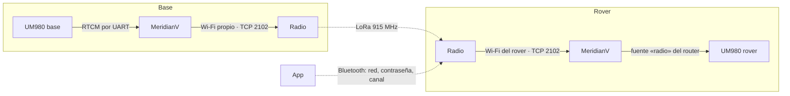

# Módulo de radio LoRa

El radio del MeridianV **no va dentro del equipo**: es un aparato aparte, que se vende por
separado, con su propio ESP32. Al encenderlo se une a la red Wi-Fi del MeridianV y los dos
hablan por ella. Decisiones del propietario del 02-10-2026.

| | |
| --- | --- |
| Placa | ESP32-S3 + **Ebyte E22-900M30S** (SX1262 + amplificador, hasta 30 dBm = 1 W; versión SPI «M»). Elegida por alcance frente a la Heltec LoRa 32 V3 (≈22 dBm): ≈8 dB más, ≈2.5 veces la distancia en campo abierto |
| Banda | **915 MHz** (902–928 MHz, libre en México) |
| Papel | **Los dos sentidos**: si su MeridianV está en base, transmite el RTCM; si está en rover, lo recibe y se lo entrega |
| Alta | La app le pasa por Bluetooth la red y la contraseña del Wi-Fi de su MeridianV |

## Por el aire (`firmware/esp32/lib/protocol/src/radio_air.h`)

- **LoRa SF7, 500 kHz, CR 4/5**: ≈21.9 kbit/s brutos. Un paquete de 255 bytes ocupa el aire
  ≈100 ms, así que caben ≈2.5 kB/s. Un RTCM MSM4 de cuatro constelaciones a 1 Hz son
  1–1.5 kB/s: cabe. **MSM7 no cabe**: la base que transmita por radio debe ir en MSM4.
- **13 canales** de 903 a 927 MHz cada 2 MHz; por omisión el 6 (915 MHz). Base y rover en el
  mismo canal.
- **Red** (0–255) en cada paquete: dos bases en el mismo canal no se mezclan; el rover solo
  acepta la suya.
- **Paquete**: `0xA7`, red, secuencia de 16 bits y hasta 251 bytes del flujo RTCM. El rover
  concatena en orden y su parser RTCM3 (CRC-24Q) saca las tramas; un paquete perdido solo
  estropea las que lo cruzaban, y al ver un salto de secuencia se reinicia el parser.
- La base espera 25 ms tras el último byte antes de mandar un paquete a medio llenar: junta
  las tramas de una época en menos paquetes.
- **Potencia**: el SX1262 a +22 dBm da ≈30 dBm a la salida de la E22 (ganancia nominal de
  8 dB, por confirmar midiendo). Por omisión 30 dBm.

**Pendiente antes de vender:** confirmar en la norma del IFT para 902–928 MHz la potencia
máxima, la ganancia de antena admitida y si LoRa a 500 kHz cuenta como modulación digital
(lo que permite 1 W sin saltos de frecuencia). Si no, bajar la potencia por omisión o añadir
saltos.

## Entre el radio y el MeridianV (`radio_link.h`)

El radio se une a la red Wi-Fi propia del MeridianV y abre TCP a `192.168.4.1:2102`. El
MeridianV solo acepta conexiones desde su propia red (192.168.4.x), nunca desde la red
externa a la que esté unido, y un solo radio a la vez.

Tramas: tipo (1 byte), longitud (2 bytes LE), carga.

| Tipo | Sentido | Carga |
| --- | --- | --- |
| `0x01` hello | radio → MeridianV | JSON: `radio_version`, `radio_id`, `hardware`, `network`, `channel`, `power_dbm` |
| `0x02` role | MeridianV → radio | JSON: `{"role":"base"|"rover"|"idle"}`; al conectar y cada vez que cambia |
| `0x03` rtcm | los dos | una trama RTCM3 completa, en bruto |
| `0x04` status | radio → MeridianV, 1 Hz | JSON: papel, red, canal, potencia, `rssi_dbm`, `snr_db`, paquetes enviados, recibidos, perdidos y ajenos; es el latido |
| `0x05` config | MeridianV → radio | JSON: `network`, `channel`, `power_dbm` (lo que cambie) |

- **Base**: el MeridianV le manda al radio cada trama RTCM que produce su receptor (la misma
  que va al caster y a la publicación).
- **Rover**: el radio entrega solo tramas con CRC válido; el MeridianV las mete en el router
  como fuente `radio`, que se elige como BLE o NTRIP. Si al conectar un radio no hay ninguna
  fuente elegida, se selecciona sola.
- Sin `status` en 5 s, el MeridianV cierra la conexión y el radio se vuelve a conectar.

## Alta y configuración desde la app (Bluetooth del radio)

El radio se anuncia por Bluetooth como **«TresVizo Radio XXXX»** (XXXX de su MAC). Servicio
`c04c0001-8f24-4adb-a350-77ef6339c320`:

| Característica | Propiedades | Uso |
| --- | --- | --- |
| `c04c0002` | write | JSON con lo que cambie: `wifi_ssid`, `wifi_password`, `network`, `channel`, `power_dbm` |
| `c04c0003` | read, notify | JSON de estado, 1 Hz: versión, Wi-Fi, conexión con el MeridianV, papel, red, canal, potencia, aire |

Como el MeridianV, va **sin emparejamiento** (decisión del propietario): cualquiera cerca
puede reconfigurarlo. La contraseña del Wi-Fi se puede escribir pero **nunca se lee** de
vuelta. Una vez unido, el canal, la red y la potencia también se cambian desde el MeridianV
(`/api/radio`), sin volver a usar el Bluetooth del radio.

## En el MeridianV

- `src/radio_link.cpp`: servidor TCP en su propia tarea (no bloquea el bucle principal),
  papel según el modo del receptor, RTCM en los dos sentidos.
- `/api/status` → `subsystems.radio`; `/api/radio` (GET estado; POST `network`, `channel`,
  `power_dbm`, que se reenvían al radio conectado).
- Fuente `radio` en `/api/corrections/source`.

## En el radio (`firmware/radio/`)

Proyecto de PlatformIO aparte (ESP32-S3, Arduino, RadioLib). Pines de la E22 en
`platformio.ini`, **por confirmar con el cableado real**. Se carga por USB con el mismo
cargador (`tools/flasher/`). Estado en un LED.

## Lo que falta

- Probarlo con dos radios en campo: alcance, pérdidas, latencia de la corrección.
- Las apps: alta del radio por Bluetooth, elegir la fuente «Radio», ver su estado y
  cambiar canal, red y potencia.
- Medir la ganancia real del amplificador y el consumo (≈650 mA a 5 V transmitiendo a 1 W).
