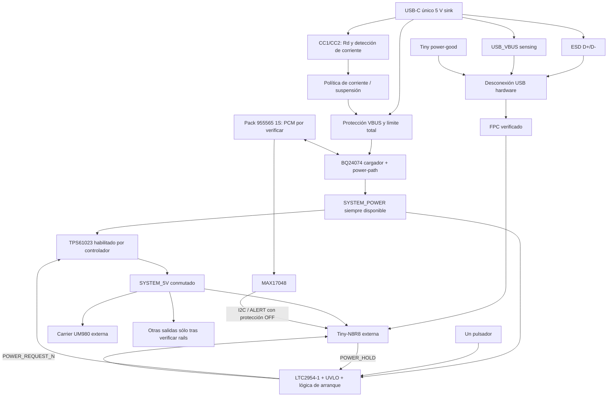

# Arquitectura propuesta y alternativas

Antecedente P1. El propietario autoriza comenzar D0 y priorizar compacidad; ver [diseño vigente](DESIGN_D0.md). La revisión USB vigente es [USB_NATIVE_REVIEW.md](USB_NATIVE_REVIEW.md). Los enlaces de fabricante están reunidos en [fuentes](datasheets/README.md).

Las flechas de 5 V a placas son conceptuales, condicionadas al presupuesto. La carcasa y módulos no se alteran. UART/PPS GNSS quedan fuera de esta placa. El inventario aún no confirma cableado completo; mantener ese enlace directo al realizarlo.

## Cargador y conversión

| Opción | Ventaja | Límite / decisión |
| --- | --- | --- |
| BQ24074 + boost | Power-path autónomo, entrada 100/500 mA o programable; cargador lineal sin segundo inductor | Propuesta inicial. OUT ~4.4 V con USB y sigue batería sin USB. Capacidad de IC hasta 1.5 A no garantiza esa corriente en A4. Requiere térmica real. |
| BQ25606 + boost independiente | Buck charger autónomo con NVDC; soporta batería ausente/descargada | Alternativa de eficiencia. Segundo switching/inductor, mayor superficie; política USB/DPDM requiere trabajo. Deshabilitar OTG: no usar su salida VBUS como rail simultáneo de carga y no devolver 5 V al host. |
| Buck-boost TPS63070 | Útil si el rail de entrada cruza 5 V | Mayor complejidad innecesaria si SYS queda por debajo de 5 V. Reevaluar para un rail 3V3 directo de batería. No es reemplazo pin a pin. |
| Power-bank integrado | Puede reducir BOM | No seleccionado: verificar pass-through real, auto-off con carga baja, comportamiento de botón, puertos y documentación. No se ha identificado un MPN que cumpla todo. |
| TP4056 solo | Simple | No satisface power-path pedido. |

TPS61023: boost con desconexión al deshabilitar; dimensionar con corriente de inductor y condiciones peores, no con «3.7 A» como salida. Su UVLO permite tensiones demasiado bajas para ser protección funcional de LiPo: añadir corte adecuado. Si sus picos/térmica no alcanzan, reabrir selección antes del esquemático. [TI TPS61023](https://www.ti.com/product/TPS61023).

La carga queda aguas arriba del apagado de los módulos. OFF con USB permite cargar, sin encender automáticamente el receptor. Pack indicado: 955565, 3.7 V/5000 mAh anunciados; imagen de dos cables, sin NTC separado visible. Evaluar NTC externo en contacto con la celda y confirmar PCM; si carece de PCM, evaluar BQ297xx + FETs antiparalelo con variante y umbrales de la celda. El gauge no protege. Añadir UVLO con histéresis y aviso previo; evitar ciclos de arranque al recuperar tensión en reposo. [TI BQ2970](https://www.ti.com/product/BQ2970).

## Estados de potencia (comportamiento objetivo, no prueba realizada)

| Estado | Ruta | Carga / condición |
| --- | --- | --- |
| A: batería sola | Pack → power-path → SYS → boost habilitado | Cargador sin entrada; datos USB desconectados sin VBUS. UVLO puede impedir ON. |
| B: USB + batería | USB → power-path → SYS; batería suplementa si corresponde | Prioridad sistema; corriente sobrante carga batería. No prometer carga positiva bajo sobreconsumo. |
| C: USB + batería descargada | USB sostiene SYS sin esperar carga completa | Precarga según charger; ON sólo si fuente puede sostener arranque. Batería descargada puede no suplir picos. |
| D: USB sin batería | USB → SYS → boost | Permitido por power-path candidato con desacoplación adecuada; limitar carga, indicar batería ausente. Puerto débil puede no sostener receptor. |
| E: se retira USB | Power-path conmuta a pack | Mantener estado ON/OFF; medir caída/ripple. Si no hay batería útil, no existe continuidad garantizada. |
| F: se conecta USB | USB asume SYS y se habilita carga permitida | Mantener estado ON/OFF; enumerar sin reset del ESP ni backfeed. |

Con pérdida total de fuentes no se garantiza graceful shutdown; energía de reserva necesaria depende de tiempo real de cierre SD. En V1 medir caída y tiempo y fijar umbral temprano antes de la protección final.

## Botón, HOLD y programación

LTC2954-1 separa interrupción por pulsación y corte por pulsación sostenida. Su EN gobierna la etapa conmutada, y `POWER_REQUEST_N` llega al ESP con pull-up al dominio lógico conmutado. `POWER_HOLD=1` mantiene KILL alto mediante adaptación apropiada; bajo/alta impedancia debe liberar alimentación tras arranque. Arranque: existe una ventana KILL de 512 ms nominales (usar mínimo garantizado para diseñar). No asumir que firmware actual la cumple. [Datasheet LTC2954, pp. 8–11](https://www.analog.com/media/en/technical-documentation/data-sheets/2954fb.pdf).

Propuesta pendiente de detalle: asistencia hardware temporal al HOLD durante arranque, con timeout finito; después exige HOLD del ESP. Para flashing, un jumper de servicio `PROGRAM_MODE` mantiene únicamente KILL válido con USB presente, aguas arriba de la decisión EN: **nunca puentear el corte long-press ni UVLO**. El cargador permanece autónomo. Tras programación retirar jumper para volver al contrato normal. Un timeout corto por sí solo no permite permanecer en el bootloader ROM. GPIO/reset/BOOT y lógica de jumper se diseñan después de verificar Tiny.

Long-press nominal objetivo 9 s, objetivo de aceptación ~8–10 s. PDT externo debe calcularse incluyendo dispersión del IC, capacitancia efectiva, temperatura y fuga; no hay valor final seleccionado ni garantía aún del intervalo. Verificar también pulsación mantenida desde OFF, liberación y rearme. Alternativa LTC2950 tiene temporización/semántica diferente y no debe sustituirse sin revisar su secuencia. Soft-latch discreto necesitaría temporizador y prioridad de corte independiente: menor coste de IC potencial, más verificación. Un load switch como TPS22919 sólo conmuta: no sustituye controller/timer. MOSFET high-side exige evaluar diodo de cuerpo, descarga y bloqueo inverso.

Secuencia normal: request → dejar de aceptar nuevas escrituras → terminar/abortar operaciones con estado registrado → flush/cerrar SD → guardar estado → bajar HOLD. Firmware pendiente, sin GPIO asignados. El apagado forzado puede perder datos y debe cortar aunque HOLD esté atascado. Reset durante uso y entrada en bootloader se ensayan por separado.

## USB-C, corriente y señales

P1 sustituye la función de Tiny-Adapter. USB Serial/JTAG nativo es preferido; **USB_VBUS y SYSTEM_5V permanecen separados**. El FPC recibe datos y alimentación interna por contactos todavía TBD; sensing observa VBUS real del host, nunca la entrada FPC alimentada por batería. Detector y switch USB propuestos garantizan desconexión sin depender del firmware. Ver la investigación enlazada para límites y pruebas pendientes.

Puerto UFP/sink, CC1 y CC2 separados con Rd nominal 5.1 kΩ cada uno a GND si se implementa pasivamente; nunca unir CC1 con CC2. Si se usa TUSB320LAI en modo sink con Rd integrado, no duplicar resistencias. Evaluar detección CC autónoma, sin depender del ESP apagado. D+ A6/B6 unidos cerca del receptáculo; D− A7/B7 igualmente. Protección ESD de baja capacitancia junto al conector, retorno corto, par USB sobre referencia continua y objetivo de impedancia según stackup. SBU y pares SuperSpeed no utilizados.

Rd permite conexión, **no autoriza por sí solo 1.5/3 A**. La limitación cuenta sistema, cargador, detector y lógica. Con Tiny apagada no hay enumeración ni bridge independiente. Resolver consumo de arranque pre-enumeración, suspender/reducir carga y secuenciar cargas si hace falta; no forzar 500 mA por defecto. MPN del limitador y tabla de control TBD.

La ruta nativa no requiere DTR/RTS ni USB-UART. Mantener pads de servicio BOOT y RUN/RESET, con funciones verificadas en la revisión real; no añadir botones exteriores ni reasignar el pulsador de encendido. Si se considera BQ25606, coordinar DPDM con conexión USB para no perturbar el par; no habilitar detectores simultáneos. No conectar Tiny-Adapter original como segunda fuente en paralelo. CP2102N sólo se reabre por una limitación demostrada y no proporciona JTAG nativo.

Se revisaron documentos oficiales USB-IF y TI; [USB-IF publica Release 2.5](https://www.usb.org/document-library/usb-type-cr-cable-and-connector-specification-release-25). El texto completo de esa revisión no fue recuperado: cumplimiento completo, límites/inrush/suspend y revisión normativa final quedan pendientes; no se declara certificación.

## USB nativo, contingencias, gauge e indicadores

| Opción | Evaluación |
| --- | --- |
| CP2102N | Fuera de P1; contingencia sólo tras documentar limitación real del USB nativo. |
| CH343P | Alternativa compacta QFN16; WCH publica driver macOS. Datos eléctricos/velocidad final pendientes de lectura completa del datasheet. |
| CH340C | Alternativa SOP16 y menor coste potencial, mayor área. No asumir igual velocidad ni compatibilidad de pines. |
| USB nativo externo | Preferido: reemplaza Tiny-Adapter y permite Serial/JTAG/flashing. FPC y sensing pendientes de cierre. |
| MAX17048 | Preferido: I2C/SOC/tensión/ALERT, sin shunt, 3 µA hibernate típico. Requiere compensación/validación con batería real. |
| BQ27441-G1A | Alternativa con shunt y estimación de capacidad/SOC; más configuración y área. Seleccionar química 4.2 V; G1B no es sustituto automático. |
| Divisor + ADC | Menor BOM, útil para tensión; bajo carga no equivale a SOC. No se omite gauge en P1. |

RGB discreto controlado por tres señales externas y drivers si hacen falta; evitar LED direccionable con consumo permanente. CHG opcional alimentado desde USB. Posición, encapsulado, difusión y resistencias TBD por mecánica/corriente; lógica de color en firmware.

## Conectores lógicos, sin números de pin ni GPIO

| Destino | Señales potenciales |
| --- | --- |
| Batería | PACK+, PACK−, NTC si disponible; polarización mecánica y eléctrica por confirmar |
| Tiny externa por FPC | D+/D−, GND, alimentación interna verificada, BOOT, RUN/RESET; contacto/numeración/capacidad TBD |
| Tiny por conector auxiliar | USB_VBUS_VALID, POWER_HOLD, POWER_REQUEST_N, BATTERY_ALERT_N, SDA/SCL, RGB_R/G/B; no asumir contactos FPC libres ni GPIO |
| UM980 carrier | POWER_OUT verificado, GND; sin UART/PPS por esta placa |
| Otras cargas | Rail verificado + GND solamente según inventario |
| Servicio | TP y jumper PROGRAM_MODE; acceso por confirmar |

Todos los cruces entre always-on, USB y alimentación conmutada requieren análisis de Ioff/back-power, incluyendo I2C del gauge cuando está sin batería pero ESP alimentado por USB. Elegir buffers/switches con desconexión adecuada; resistencias en serie por sí solas no demuestran ausencia de alimentación parásita.
