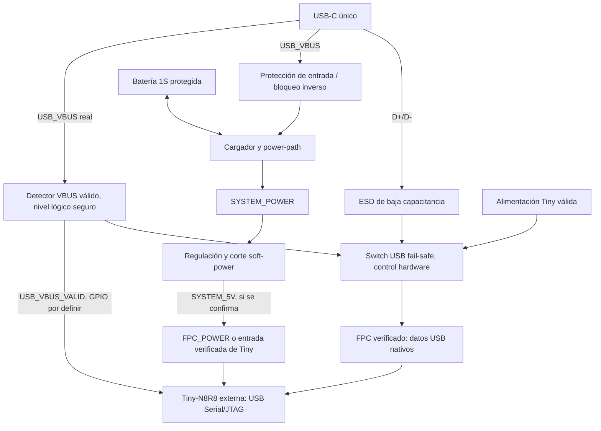

> ANTECEDENTE DE INVESTIGACIÓN. La revisión vigente con esquema y PCB ruteado está en [README.md](README.md) y [rev-a/DESIGN.md](rev-a/DESIGN.md). Las indicaciones de fase/pendiente de aprobación siguientes describen su fecha original.

# Revisión P1: USB nativo y sustitución de Tiny-Adapter

Estado: propuesta preferida pendiente de aprobación, sin esquemático. El propietario identifica la placa utilizada como **Waveshare ESP32-S3-Tiny-N8R8**. La Power Board sustituirá también la función del Tiny-Adapter y conservará Tiny como módulo externo. CP2102N queda fuera de la arquitectura preferida y de su BOM prevista.

## Evidencia oficial y límites

La [página oficial de recursos Waveshare](https://docs.waveshare.com/ESP32-S3-Tiny/Resources-And-Documents) enlaza los dos PDF conservados en `datasheets/waveshare/`. No ofrece ahí un esquema separado explícitamente rotulado N8R8. Se leyeron visualmente las tres páginas, además de extraer texto; no se derivó pinout de OCR solamente.

- [Tiny, una página](https://files.waveshare.com/wiki/ESP32-S3-Tiny/ESP32-S3-Tiny-Sch.pdf): U2 es **ESP32-S3FH4R2**, L1 dice `0.5-8pin`. USB_N/P pasan por R6/R7 de 22 Ω hacia GPIO19/20. IO0 y RESET salen al FPC; RESET llega a CHIP_PU. VBUS del FPC alimenta VCC_5V mediante D1 B5819WS y luego el LDO ME6217C33M5G. Se observa alimentación de placa, no una entrada GPIO dedicada de detección de VBUS. Este plano no certifica la variante N8R8 recibida.
- [Tiny-Adapter, dos páginas](https://files.waveshare.com/wiki/ESP32-S3-Tiny/Tiny-Adapter.pdf): el esquema une directamente D_N/P de USB-C al conector U1, sin USB-UART. USB VBUS se llama VSYS; hay dos Rd de 5.1 kΩ, pulsadores BOOT/RUN a GND y LED de alimentación. U1 numera 1–10; 9/10 están a GND. La segunda página muestra serigrafía RESET/BOOT, sin plano de contactos suficiente para decidir si 9/10 son anclajes. **Diez números de símbolo no prueban diez contactos del cable.**

La [descripción Waveshare](https://docs.waveshare.com/ESP32-S3-Tiny) anuncia FPC de 0.5 mm/8 pines. No resuelve el símbolo anterior ni certifica revisión, cara de contacto, espesor de cable o MPN. No se publica tabla pin-a-pin para fabricar. Una numeración de PDF tampoco determina el orden físico extremo-a-extremo del cable.

El repositorio conserva evidencia histórica de una Tiny FH4R2 con 4 MB/2 MB y firmware configurado a 4 MB; se registra la corrección N8R8 sin borrar esas lecturas. Falta reconciliar si pertenecían a otra unidad. No se modifica firmware, particiones o memoria en esta revisión.

## Arquitectura preferida

El switch no es un bridge ni hub. Se propone para desconectar físicamente ambos datos sin depender del firmware cuando no hay VBUS o la Tiny está apagada. MPN y dimensionamiento pendientes; comprobar soporte USB full-speed, Ioff, alimentación parcial, capacitancia, resistencia ON, retardo y estados de OE. ESD cerca del receptáculo, retornos cortos y continuidad de referencia. No duplicar resistencias serie de Tiny sin verificar su revisión y el canal completo PCB–FPC.

**USB_VBUS y SYSTEM_5V son redes distintas y nunca se unen directamente.** FPC_POWER es una función pendiente de mapear, aunque el plano histórico llame «VBUS» a su entrada. Si se alimenta esa entrada desde SYSTEM_5V, será una red interna de alimentación, no detector del host. No llevar también USB_VBUS a ese contacto. Comprobar si el punto de entrada definitivo queda antes o después del diodo de Tiny y calcular caída/rango del LDO; no puentearlo por conveniencia.

No copiar la unión VBUS=VSYS del adaptador oficial: éste no documenta nuestro sistema a batería. El bloqueo inverso debe cubrir todos los caminos, incluido charger, regulador, protección ESD, detector, datos y alimentación alternativa. El diodo de la Tiny no demuestra ausencia de backfeed del conjunto. GND sí es común; no hay aislamiento galvánico propuesto.

## USB Serial/JTAG y detección VBUS

[Espressif USB Serial/JTAG](https://docs.espressif.com/projects/esp-idf/en/stable/esp32s3/api-guides/usb-serial-jtag-console.html) confirma consola CDC, flashing y JTAG con OpenOCD, sin puente externo; serial y JTAG pueden operar simultáneamente. Puede entrar automáticamente en download. Si el firmware deshabilita USB o reasigna los pines, se recupera mediante BOOT y reset. Sleep puede interrumpir la conexión. Esto justifica preferir el controlador hardware para los requisitos solicitados.

[Espressif USB Device Stack v5.4, Self-Powered Device](https://docs.espressif.com/projects/esp-idf/en/v5.4/esp32s3/api-reference/peripherals/usb_device.html#self-powered-device) pide observar VBUS mediante divisor o comparador: válido por encima de 4.75 V, inválido por debajo de 4.35 V, y señal baja dentro de 3 ms al desenchufar. Los GPIO no aceptan 5 V directos. Para **TinyUSB/USB-OTG**, indica `self_powered=true` y `vbus_monitor_io`. Esos campos **no configuran USB Serial/JTAG hardware ni el bootloader ROM**.

Propuesta de ingeniería: detector de USB_VBUS del lado host, antes de cualquier red retenida por batería; salida segura a lógica conmutada y a control autónomo del switch. `DATA_CONNECT = VBUS_VALID AND TINY_POWER_GOOD`. OFF por defecto, también sin alimentar detector/switch. Verificar histéresis, tolerancias, transitorios y caída de VBUS con capacitancia del puerto; un condensador retenido puede falsear presencia del host. La función debe mantenerse en ROM, reset, firmware bloqueado y debug detenido. Divisor simple sólo sería alternativa tras demostrar umbrales y ausencia de inyección con Tiny apagada.

El GPIO de sensing podrá requerir cable adicional: el FPC histórico no prueba que exista un contacto libre para USB_VBUS_VALID. No reutilizar BOOT/RUN ni asumir que la alimentación FPC permite detectar al host. Igual para POWER_HOLD/REQUEST, I2C, ALERT y RGB: prever conector auxiliar sin integrar otra MCU.

El controlador Serial/JTAG es de función fija; no se presupone que podamos cambiar sus descriptores mediante TinyUSB. Revisar sus declaraciones de alimentación, consumo/suspend y comportamiento real antes de declarar cumplimiento USB del producto híbrido batería/USB. Tampoco prometer TinyUSB y JTAG simultáneos sobre el mismo PHY interno; esa coexistencia no forma parte de P1.

## Alimentación y recuperación

- Batería sola: Tiny puede trabajar; datos desconectados del receptáculo sin VBUS válido.
- USB + receptor ON: datos habilitados con alimentación válida; sistema/carga según presupuesto y corriente autorizada.
- USB + receptor OFF: carga posible, Tiny y datos apagados. Para flashing/debug hay que encender o habilitar modo de servicio; conectar USB no implica autoencendido aprobado.
- Reset/ROM/JTAG detenido: asistencia de alimentación independiente del firmware; conservar PROGRAM_MODE aguas arriba de EN. Long press y UVLO siguen teniendo prioridad sobre HOLD/mode de servicio.
- Desenchufar USB con batería: cortar datos, conservar alimentación y ejecución salvo política de firmware; no resetear por pérdida de VBUS. Sin batería útil no se promete continuidad.
- USB con batería ausente/agotada: arrancar sólo dentro de la corriente disponible. Eliminar bridge elimina consumo externo, pero ahora no hay dispositivo USB enumerado mientras Tiny está OFF. Resolver arranque de Tiny con presupuesto pre-enumeración, limitación de carga y posibilidad de secuenciar cargas externas; no elevar consumo a 500 mA sólo para poder enumerar.

BOOT y RUN/RESET serán señales de recuperación accesibles mediante pads/jumper/conector de servicio, sin añadir automáticamente botones exteriores. Verificar sus niveles/polaridad en la revisión real y no conectarlas al pulsador de potencia como si cumplieran la misma función. No hay DTR/RTS externos en la ruta nativa.

## Verificación física pendiente: bloqueo para FPC

El propietario reporta únicamente `ESP32-S3-TINY` en la cara posterior. No distingue revisión/N8R8 y no aporta todavía conteo del FPC. No se encontró en el repositorio foto legible de ambas caras de la unidad/cable ni hay acceso físico para contar contactos o medir continuidad. N8R8 queda confirmado **por declaración del propietario**, no por una inspección que no se realizó.

Antes de seleccionar símbolo, huella y cable:

1. Registrar serigrafía/revisión de Tiny y adaptador, marcaje del encapsulado y fotos macro de conectores/cable por ambas caras.
2. Contar conductores reales excluyendo anclajes. Medir paso, espesor FPC, altura y orientación; identificar cara de contacto arriba/abajo y cable mismo lado/opuesto.
3. Sin alimentación, contrastar continuidad de cada conductor extremo-a-extremo, GND, D+/D−, alimentación, BOOT y RUN con el esquema exacto; distinguir contactos de montaje. No hacer prueba de continuidad sobre placa alimentada.
4. Vincular esquema/BOM/MPN a esa revisión; pedir aclaración al fabricante si persiste discrepancia. No se envió mensaje a Waveshare.
5. Reconciliar la identificación histórica 4/2 con N8R8 y verificar firmware/memoria en una tarea posterior antes de flashear.

## CP2102N: sólo contingencia

No se identificó una razón concreta para incluirlo ahora. Reabrir sólo si la unidad real no expone un USB usable, una restricción demostrada impide el acceso necesario o se exige una consola UART independiente. No soluciona USB-JTAG y no resuelve por sí solo FPC, potencia ni sensing. Cualquier contingencia requiere nueva revisión; no reservar un segundo bridge poblado ni conectarlo en paralelo a D+/D−.

## Pruebas de aceptación pendientes

Continuidad FPC; voltajes en ambos extremos; USB A-C/C-C en ambas orientaciones; flashing y recuperación BOOT/RESET; consola y OpenOCD simultáneos; programación detenida sin caída de HOLD; OFF/ON/USB/batería ausente/baja; desenchufe con ESP detenido en breakpoint; señal sense baja dentro del límite documentado; ausencia de backfeed con host apagado y receptor a batería; datos desconectados sin VBUS y sin alimentación Tiny; consumo pre-enumeración/suspend; integridad de señal de cable/FPC y ESD. Ninguna se presenta como ensayo físico completado.
