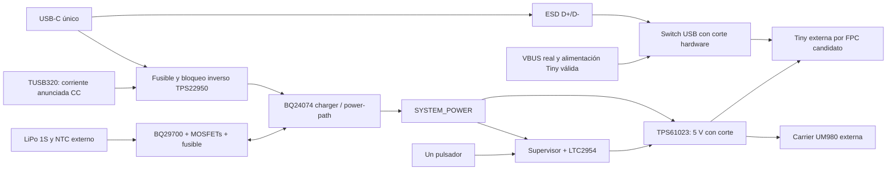

# Diseño Rev A — prototipo

La placa reemplaza carga, power-path, elevador, encendido y función USB del Tiny-Adapter. No contiene los módulos externos ni rediseña la carcasa. El contorno compacto de 45 × 40 mm sigue las últimas instrucciones del propietario; dos agujeros NPTH de 2.2 mm sirven de referencia de montaje.

`USB_VBUS`, `USB_INPUT_PROTECTED`, `SYSTEM_POWER` y `SYSTEM_5V` son redes distintas. No existe unión directa entre los dos rails de 5 V. `TINY_3V3` llega desde la Tiny mediante J6 y alimenta/referencia sus interfaces; no es una salida general de la Power Board. `AON_3V0` sostiene la lógica de potencia durante OFF.

## Componentes seleccionados

| Función | Selección | Razón |
| --- | --- | --- |
| Charger / power-path | BQ24074RGTR | CC/CV 1S, sistema con batería ausente y reparto de corriente |
| Protección entrada | TPS22950YBHR | Límite ajustable y bloqueo inverso siempre activo |
| Detección CC | TUSB320LAIRWBR | Usar corriente anunciada; no asumir 500 mA antes de enumerar |
| Protección batería | BQ29700DSER + 2 × CSD13202Q2 | Protección secundaria independiente del PCM desconocido de la batería |
| 5 V conmutado | TPS61023DRLR | Elevación desde 1S y desconexión de salida en OFF |
| Soft-power | LTC2954ITS8-1#TRMPBF + lógica y supervisores | Arranque temporal, HOLD, interrupción y corte largo autónomo |
| Fuel gauge | MAX17048G+T10 | Tensión/SOC por I2C, poco consumo |
| USB nativo | TS3USB31ERSER | Desconexión de datos con VBUS ausente o Tiny apagada |
| I2C / ALERT | TMUX1511PWR | Evitar alimentar interfaces apagadas desde la batería |
| ESD | USBLC6-2SC6 y PESD5V0S1UL,315 | Datos/VBUS y las dos señales CC |
| LEDs / selección ILIM | AO3400A | RDS(on) especificada con puerta a 2.5 V |

Fuentes: [BQ24074](https://www.ti.com/lit/ds/symlink/bq24074.pdf), [TPS22950](https://www.ti.com/lit/ds/symlink/tps22950.pdf), [TUSB320LAI](https://www.ti.com/lit/ds/symlink/tusb320lai.pdf), [BQ2970](https://www.ti.com/lit/ds/symlink/bq2970.pdf), [TPS61023](https://www.ti.com/lit/ds/symlink/tps61023.pdf), [LTC2954](https://www.analog.com/media/en/technical-documentation/data-sheets/2954fb.pdf), [MAX17048](https://www.analog.com/media/en/technical-documentation/data-sheets/MAX17048-MAX17049.pdf), [TS3USB31E](https://www.ti.com/lit/ds/symlink/ts3usb31e.pdf), [TMUX1511](https://www.ti.com/lit/ds/symlink/tmux1511.pdf), [AO3400A](https://www.aosmd.com/sites/default/files/res/datasheets/AO3400A.pdf). Pinouts y MPN constan en circuit.json; huellas especiales en Power.pretty.

Se descartó TP4056 simple por su falta de power-path adecuado. Charger y boost separados permiten corte y diagnóstico explícitos. No se encontró necesidad de CP2102N/CH340/CH343: USB Serial/JTAG hardware satisface las funciones solicitadas. La alternativa UART sólo se reabre ante una limitación demostrada; no hay bridge ni conexión en paralelo a D+/D−.

## Ajustes eléctricos

Carga 4.2 V, ISET=1.78 kΩ: aproximadamente 500 mA, antes de regulación térmica o reducción por consumo del sistema. **TMR a GND desactiva el temporizador de seguridad de carga del BQ24074.** Es una opción documentada por TI: 5000 mAh a 500 mA ya necesitan 10 h ideales de CC, más CV, superando el temporizador utilizable. Se mantienen NTC, regulación y protector secundario, pero esta revisión no impone un máximo absoluto de horas de carga. Esta decisión debe evaluarse en los ensayos del producto.

NTC externo Semitec 103AT-2, 10 kΩ, adherido térmicamente a la celda y conectado a J3. El circuito estándar del BQ24074 corresponde a carga nominal 0…50 °C. Falta confirmar que la batería permite ese rango y corriente. No sustituir el NTC por un resistor fijo en uso real. La batería de dos hilos no aporta esa señal.

La rama USB permite unos 50 mA nominales por defecto y unos 1 A cuando CC anuncia 1.5 A o 3 A. Los resistores de límite son 19.1 kΩ y 1.21 kΩ conmutado en paralelo. La lógica USB añade su propio consumo. No implementa BC1.2 ni USB-PD. En un puerto legacy la batería debe sostener el receptor durante desarrollo; no se garantiza arranque sin batería.

Boost: divisor 732 kΩ/100 kΩ, 0.1%, nominal 4.992 V. Punto inicial de ensayo: 5 V / 0.6 A totales, no una corriente máxima medida. Salidas GNSS y Tiny comparten rail. UVLO del sistema nominal 3.10 V, histéresis y recuperación retardada; requiere nueva pulsación después del corte.

Consumo OFF estimado a batería: orden 0.4–0.5 mA, no <100 µA. El pull-up de 10 kΩ de VBUS válido consume unos 300 µA sin USB y proporciona margen en PROGRAM_MODE. Ver POWER_BUDGET.md.

Fusibles F1/F2: **046601.5NRHF / 0466002.NRHF**, Littelfuse serie 466, 1206; no la serie 467. [Fabricante](https://www.littelfuse.com/products/fuses-overcurrent-protection/fuses/surface-mount-fuses/thin-film-chip-fuses/466). Puerto sólo 5 V: ESD y limitación de corriente no equivalen a OVP para una entrada errónea de 9–20 V.

## Control y USB

Una pulsación de unos 0.33 s activa el sistema. La ventana de arranque es ~5.7 s nominales; el firmware debe afirmar POWER_HOLD al inicio, objetivo <2 s. Pulsar estando ON produce POWER_REQUEST_N; tras cerrar SD/guardar estado el ESP baja HOLD. Un long press fuerza el corte por hardware a ~8.98 s nominales. El intervalo real incluye tolerancias del IC y capacitores: 8–10 s es objetivo nominal, no garantía en todas las condiciones.

JP1 PROGRAM_MODE, normalmente abierto, permite ROM/flashing/JTAG detenido sin depender de HOLD mientras USB sea válido. Requiere encender con el botón. Impide el apagado sólo por HOLD mientras esté cerrado; long press y UVLO siguen teniendo prioridad.

La investigación oficial [Waveshare/Espressif](../USB_NATIVE_REVIEW.md) distingue la Tiny real N8R8 del esquema genérico FH4R2. GPIO19/20 son D−/D+ en ese plano, con 22 Ω ya presentes. No se duplican. La alimentación del FPC es SYSTEM_5V: no sirve para detectar host cuando el equipo funciona con batería.

R28/R29=101 kΩ/10 kΩ, 0.1% y 10 ppm/°C: corte nominal 4.4955 V. Con tolerancia de referencia, histéresis máxima, bias y TCR hasta 100 °C de diferencia, el cálculo da corte mínimo 4.387 V y reconocimiento máximo 4.743 V. R31/R32=649 kΩ/100 kΩ, 0.1%, califican Tiny. [TPS3808, características eléctricas](https://www.ti.com/lit/ds/symlink/tps3808.pdf). El switch exige ambas condiciones; el corte es hardware y el reconocimiento tiene unos 20 ms de calificación.

Debe medirse que sensing baje en <3 ms al desconectar USB. El resistor de descarga y capacitancia limitada ayudan, pero no prueban ese transitorio. TinyUSB usa `self_powered` y `vbus_monitor_io`; no configuran USB Serial/JTAG hardware ni ROM. [Espressif USB Device Stack](https://docs.espressif.com/projects/esp-idf/en/v5.4/esp32s3/api-reference/peripherals/usb_device.html#self-powered-device), [Serial/JTAG](https://docs.espressif.com/projects/esp-idf/en/stable/esp32s3/api-guides/usb-serial-jtag-console.html).

## Estados previstos, por comprobar en banco

| Estado | Comportamiento | Condición |
| --- | --- | --- |
| Batería sola | ON por botón; datos USB aislados | Batería por encima de UVLO |
| USB + batería | Sistema y carga comparten corriente | Presupuesto/temperatura suficientes |
| USB + batería agotada | Precharge y posible arranque por power-path | Fuente C-C con anuncio ≥1.5 A |
| USB sin batería | Alimentación posible por power-path | Igual restricción; gauge no acredita batería presente |
| USB → batería | Continúa ejecución; datos se desconectan | Batería útil y transitorio aceptable |
| Batería → USB | Continúa sistema; carga según presupuesto | Sin unir rails de 5 V |
| USB con receptor OFF | Carga posible, Tiny/datos apagados | Botón para desarrollo/programación |
| Suspend legacy | Firmware eleva USB_SUSPEND y corta entrada del charger | Medir consumo residual y descriptores reales |

En ausencia de batería el charger puede elevar PACK_P: GAUGE_VOLTAGE_OK no demuestra presencia física. No interpretar SOC en ese estado.

Faltan pruebas con la celda y módulos reales: polaridad, límites, capacidad, térmica, transitorios, USB, backfeed, ESD y efecto sobre GNSS. J5 queda DNP hasta comprobar cable/revisión. El protocolo está en BRINGUP.md.
