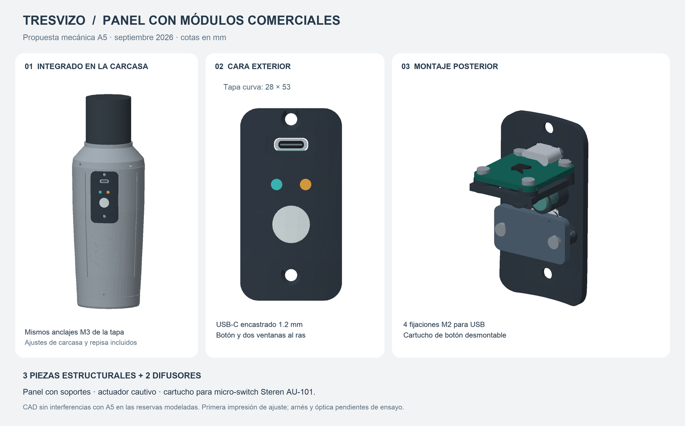

# Panel exterior y montaje

> **Revisión conjunta posterior:** usar la salida de [integration-review](../../mechanical/integration-review/README.md) para combinar con el A5 simplificado. Conserva ejes y cara general; usa M3×8 de cabeza botón con apoyo plano y cabezas M2 ISO4762 Ø3.8×2. Los avellanados y `A5_ElectronicsTray` descritos en la entrega inicial de abajo son antecedentes. Véase [informe y pendientes de ensamblaje](../../docs/INTEGRATION_REVIEW.md).

El panel ya tiene una **propuesta CAD con soportes**, dentro de [mechanical/panel-modules](../../mechanical/panel-modules/README.md). Sustituye el dibujo preliminar como referencia mecánica vigente. El maestro A5 queda conservado.

| Elemento | Posición X / Z en A5, mm | Montaje |
| --- | --- | --- |
| USB-C comercial Adafruit 5871 | 0 / 132 | Cuatro apoyos M2 integrados; boca encastrada 1.2 y rebaje para enchufe. |
| Estado RGB | −4 / 121 | Difusor al ras; LED Steren Ø5 en alojamiento posterior. |
| Carga | +4 / 121 | Difusor al ras; alojamiento para guía óptica del PowerBoost. |
| Botón | 0 / 110 | Actuador curvo cautivo Ø9.8; cartucho desmontable para AU-101 nominal de 6 mm. |
| Anclajes de tapa | 0 / 96 y 0 / 139 | Conserva ejes M3; avellanados para cabeza ≤Ø5.6. |

La tapa nominal mide 28 × 53. Tres piezas estructurales: panel con soportes, actuador y cartucho. Los dos difusores se fabrican en material translúcido. Se incluyen STEP, STL, un cupón de ajuste, parámetros y comprobación de interferencias.

La copia de carcasa amplía la abertura; la copia de bandeja retira la antigua repisa USB y la cuna provisional del biestable. No se mueve la referencia de la IMU. El Tiny-Adapter original recibe una nueva reserva vertical, conservando el conjunto FPC original; su retención y cableado final pertenecen a la integración interior.

**Los soportes exteriores están modelados; el montaje interno del cargador y biestable no está completado en este panel.** Sus placas comerciales pueden ir en otros puntos del case. Reservas publicadas: PowerBoost 23 × 45 × 10 con USB-A instalado —se deja USB-A sin montar—; SparkFun 25.4 × 25.4 más conectores/cables reales.

El AU-101 no tiene cotas publicadas en la ficha de Steren; la cuna usa dimensiones nominales editables y debe contrastarse con el componente comprado. No afirmar encaje físico, carrera, visibilidad óptica, estanqueidad ni USB ensayados por disponer del CAD. Véanse [montaje y límites](../../mechanical/panel-modules/README.md), [compra en México](SOURCING_MX.md) y [arnés](WIRING.md).
