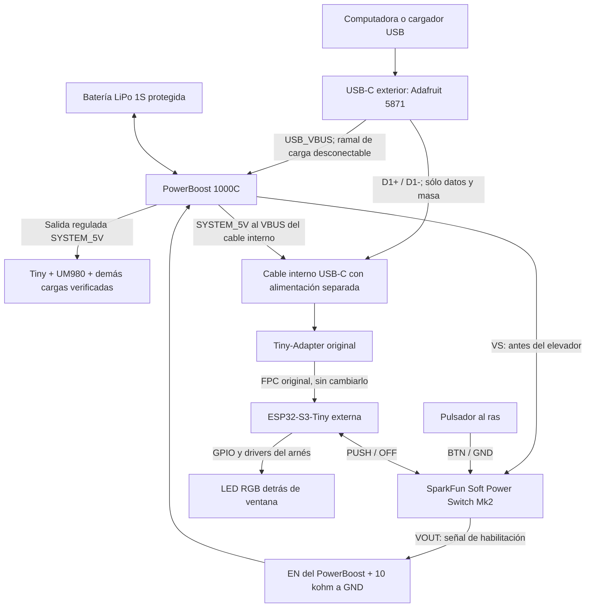

# Alimentación e interfaz con módulos comerciales

Revisión del 20 de septiembre de 2026. Sustituye la propuesta de PCB personalizada por módulos comprables y un arnés. Se conservan la Tiny, su Tiny-Adapter y cable original, el UM980, BMI088, microSD y batería. Se entrega una [propuesta CAD independiente para el panel y sus soportes](../../mechanical/panel-modules/README.md), con ajustes a copias de carcasa y bandeja. El maestro A5 y el firmware se conservan.

**Resultado: tres módulos principales, pulsador y dos ventanas de luz en el panel.** El USB-C exterior se usa para alimentación/carga y para el USB nativo del ESP32. El botón exterior acciona el encendido electrónico; el cierre de archivos antes de apagar requiere integración en firmware. No hay PCB que mandar fabricar.

Es una selección y un diseño de interconexión para prototipo, contrastados con documentación. No es un montaje ensayado ni una declaración de cumplimiento USB. Las limitaciones concretas de corriente del host, detección VBUS y protección se indican abajo; no están resueltas simplemente por comprar las tres placas.

## Lista principal

Precios publicados al consultar; excluyen envío e impuestos adicionales. Se distinguen USD y MXN. Véase [suministro para México](SOURCING_MX.md) para vendedores y disponibilidad real observada.

| Función | Producto comprado ya montado | Cantidad | Precio |
| --- | --- | ---: | ---: |
| Cargador LiPo 1S, power-path y elevador | [Adafruit PowerBoost 1000C, 2465](https://www.adafruit.com/product/2465) | 1 | $19.95 |
| Pulsador electrónico, apagado por software y forzado | [SparkFun Soft Power Switch Mk2 JST 2 mm, PRT-26993](https://www.sparkfun.com/sparkfun-soft-power-switch-jst-2mm.html) | 1 | $7.32 |
| USB-C exterior y desconexión de datos | [Adafruit TS3USB30, 5871](https://www.adafruit.com/product/5871) | 1 | $3.95 |
| Pulsador bajo un actuador impreso al ras | [Steren AU-101, momentáneo NA](https://www.steren.com.mx/micro-switch-de-push-con-4-terminales.html) | 1 | $2 MXN |
| Indicador de estado RGB | [Steren LED-5/RGB, ánodo común](https://www.steren.com.mx/led-de-5-mm-rgb.html) | 1 | $5 MXN |

**Los tres módulos suman $31.22 USD; pulsador y RGB suman $7 MXN.** El presupuesto anterior de $35.72 USD empleaba dos periféricos Adafruit y queda sustituido por esta selección local. Añadir cable USB corto, cableado, resistencias, transistores, fusibles, tornillos, piezas ópticas y envío/importación. El costo total entregado no está cotizado; tampoco incluye una protección de batería adicional si el pack carece de ella ni las ampliaciones USB descritas abajo. No se compró nada.

El indicador de carga aprovecha los LEDs amarillo y verde del PowerBoost mediante guías ópticas hacia una segunda ventana. Así funciona con el receptor apagado y no requiere otra placa ni modificar las salidas del cargador.

## Conexión general

**USB_VBUS del conector exterior y SYSTEM_5V son redes distintas.** La alimentación del cable USB interno hacia Tiny-Adapter proviene de SYSTEM_5V. No se conecta a los pads de alimentación de las salidas del TS3USB30: esos pads están unidos a USB_VBUS y no son salidas aisladas.

El PowerBoost integra MCP73871 para reparto entre fuente/carga/batería y TPS61090 para elevar a aproximadamente 5.2 V. La protección contra descarga inversa del cargador y la separación del arnés evitan la ruta directa batería → host. Debe comprobarse el conjunto montado. [Esquema oficial](https://github.com/adafruit/Adafruit-PowerBoost-1000C), [MCP73871](https://www.adafruit.com/datasheets/MCP73871.pdf).

## Encendido y apagado

Se alimenta el SparkFun desde **VS**, no desde la salida de 5 V. Su salida controla **EN** del PowerBoost y una resistencia de 10 kΩ asegura el estado apagado. No transporta la corriente de todas las cargas. Esto permite apagar el elevador, cargar con el equipo apagado y conservar el apagado forzado por hardware.

El esquema oficial del PowerBoost Rev B tiene un pull-up de 200 kΩ en EN. Con 10 kΩ a masa, apagado queda nominalmente a 0.0476 × VS, por debajo del límite LOW de 0.2 × VS del TPS61090. Encendido sigue a VS y supera 0.8 × VS. Es un cálculo del circuito, pendiente de ensayo del conjunto. [Archivos Adafruit](https://github.com/adafruit/Adafruit-PowerBoost-1000C), [TPS61090](https://www.adafruit.com/datasheets/tps61090.pdf).

El pulsador se conecta a BTN/GND; PUSH informa al ESP32 y OFF alto corta. Una pulsación sostenida unos diez segundos corta por hardware. Abrir los jumpers de LEDs IN/OUT del SparkFun evita luz y consumo internos innecesarios. El consumo de toda la instalación apagada debe medirse; el dato de reposo del módulo no representa el sistema completo. [Guía SparkFun](https://docs.sparkfun.com/SparkFun_Soft_Power_Switch_Mk2/single_page/).

## Qué permite el puerto único

| Estado | Comportamiento previsto |
| --- | --- |
| Batería, equipo ON | Operación normal; el puerto exterior no suministra 5 V al host. |
| USB, equipo OFF | Carga; sin consola porque el ESP32 está apagado. |
| USB, equipo ON | Carga/alimentación y datos simultáneos, dentro de la corriente disponible. |
| Debug detenido en un breakpoint | Alimentación mantenida por el módulo; no necesita heartbeat del firmware. |
| Firmware bloqueado | Pulsación larga corta; para recuperar el firmware quedan BOOT/RUN del Tiny-Adapter. |

El USB nativo proporciona flashing, consola Serial/JTAG y depuración del **ESP32**. El UM980 se consulta desde esa consola mediante su UART y software de puente/diagnóstico que debe implementarse. **No se promete que el programa de actualización de Unicore pueda reflashear el UM980 a través del ESP32 sin ese puente y sin verificar su protocolo.** No hay acceso JTAG al UM980 a través del JTAG del ESP32. [Espressif USB Serial/JTAG](https://docs.espressif.com/projects/esp-idf/en/stable/esp32s3/api-guides/usb-serial-jtag-console.html).

## Límites que condicionan el montaje

1. **Corriente del USB.** PowerBoost está configurado para fuente de pared y carga de hasta 1 A; no negocia por sí mismo el presupuesto de un puerto de computadora. Para carga y operación simultáneas usar una fuente/puerto documentado de 5 V y al menos 2 A, compatible con su margen de entrada. Las resistencias CC de la placa USB no autorizan a tomar 2 A de cualquier puerto. Para un puerto de datos de capacidad desconocida, abrir el ramal interno `CHARGE_LINK` y operar desde batería: el mismo USB-C sigue dando datos. Para automatizar carga limitada en todos los puertos haría falta gestión adicional de corriente; no se presenta como resuelta.
2. **Batería.** La referencia 955565 anunciada es 1S, 3.7 V/5000 mAh. Antes de conectarla se comprueban polaridad, protección PCM y admisión de carga a 4.2 V/1 A. PowerBoost no sustituye una protección de pack ni incorpora un termistor pegado a esta batería. La carga de una celda cuya protección y límites se desconocen no queda validada. Se conserva la [evidencia original](../power-board/BATTERY_REFERENCE.md).
3. **USB self-powered.** El TS3USB30 permite desconectar los datos cuando está sin alimentación y seleccionar un canal vacío cuando Tiny está apagada. Eso **no demuestra** los umbrales de detección VBUS ni el tiempo de desconexión. Espressif indica detección válida por encima de 4.75 V, inválida por debajo de 4.35 V y señal baja en 3 ms al desconectar. Los condensadores de los módulos pueden retener VBUS. El prototipo requiere medirlo y completar detector/descarga si procede; no es una solución certificada. `self_powered` y `vbus_monitor_io` pertenecen a TinyUSB/OTG, no configuran Serial/JTAG ni ROM. [Espressif](https://docs.espressif.com/projects/esp-idf/en/v5.4/esp32s3/api-reference/peripherals/usb_device.html#self-powered-device), [TI TS3USB30](https://cdn-shop.adafruit.com/product-files/5871/ts3usb30.pdf).
4. **Protección y corriente del sistema.** El módulo USB no trae una matriz TVS dedicada; la especificación HBM del chip no acredita ESD del equipo. Para uso de campo debe completarse esa protección y ensayarse. El elevador se selecciona para un presupuesto inicial de hasta 1 A; comprobar arranque, radio, microSD, ruido GNSS y margen térmico con todos los módulos. Verificar las entradas de alimentación reales antes de distribuir 5.2 V. No aplicar 5.2 V al chip BMI088 ni a señales de 3.3 V.

Estos puntos separan el prototipo económico de la anterior propuesta de producto con protecciones adicionales; no deben ocultarse en una lista de compras presentada como equivalente.

## Archivos y alternativas evaluadas

- [Cableado y control](WIRING.md).
- [Montaje al panel y dimensiones para mecánica](PANEL.md).
- [CAD, STEP, STL y render del panel](../../mechanical/panel-modules/README.md).
- [Proveedores para México](SOURCING_MX.md).
- [Diagrama inicial del reparto](panel-and-modules.svg), anterior a seleccionar pulsador y RGB Steren; no usar sus precios como presupuesto vigente.

El [Adafruit bq25185 + boost 6106](https://www.adafruit.com/product/6106), de $8.95, ahorra $11, pero su guía advierte arranque con cargas por encima de 200 mA y un temporizador de carga fijo de seis horas. No se elige sin resolver esas condiciones para el GNSS y la batería de 5 Ah. [Limitaciones oficiales](https://learn.adafruit.com/adafruit-bq25185-usb-dc-solar-charger-with-5v-boost-board/pinouts).

El [DFRobot MP2636 DFR0446](https://www.dfrobot.com/product-1613.html), de $8, es otra alternativa documentada con power-path, pero requiere cerrar corriente de carga/entrada, control OFF y transiciones de fuente de la placa concreta antes de sustituir el PowerBoost. El biestable verde que ya tiene el proyecto puede reutilizarse sólo después de identificar sus señales y comprobar apagado controlado/forzado; no se atribuyen esas funciones por su anuncio. CP2102N queda fuera.

Se retiraron únicamente archivos de diseño/fabricación de PCB dentro de `hardware/power-board/`. Los documentos y datasheets anteriores se conservaron como antecedentes. No se borró firmware, CAD, archivos mecánicos ni módulos del receptor.
