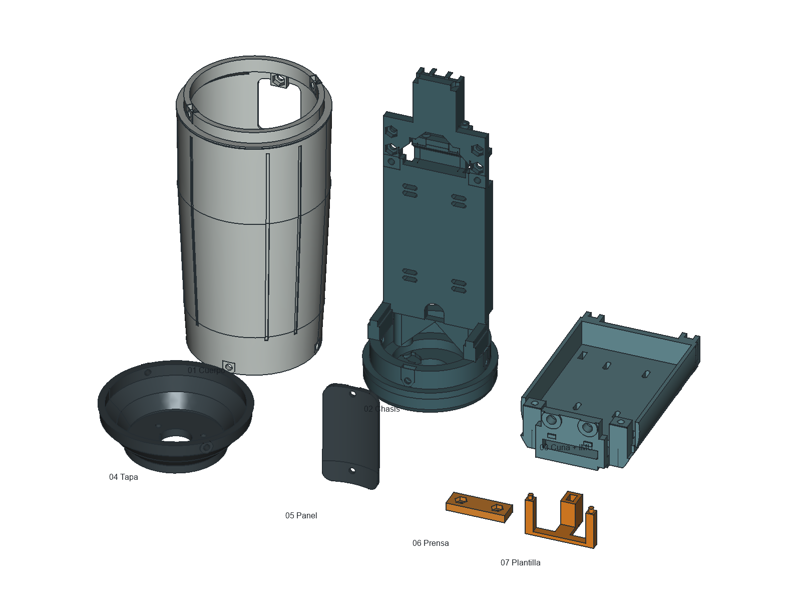

# A5 simplificado: impresión y montaje

> Revisión conjunta posterior: [INTEGRATION_REVIEW.md](../../docs/INTEGRATION_REVIEW.md) detectó choques durante el desplazamiento axial del cuerpo sobre chasis/cuna. La validación de inserción local descrita abajo no resuelve esa operación. La secuencia y liberación de impresión completa quedan pendientes; alimentación vigente por módulos comerciales, no PCB personalizada. Este documento conserva la descripción del maestro A5 sin modificar.

20 de septiembre de 2026. Maestro único: [TresVizo-A5.FCStd](TresVizo-A5.FCStd). **Prototipo comprobado en CAD; todavía no ensayado físicamente ni laminado con una impresora concreta.** Se mantiene pendiente la integración de la PCB en desarrollo, los herrajes definitivos de otras placas y el inserto del jalón.

## Reducción real

| Elemento del conjunto mecánico definido | Antes | Ahora |
| --- | ---: | ---: |
| Impresiones permanentes | 7 | **6** |
| Plantilla de centrado reutilizable | 1 | **1** |
| Tornillos de cierres, estructura e IMU | 23 | **15** |
| Tuercas de esos tornillos | 20 | **12** |
| Arandelas sueltas | 9 | **0** |

El CAD anterior sólo representaba 17 tornillos: faltaban los cuatro del cierre de tapa y los dos del panel, aunque sus agujeros ya existían. Por eso la comparación funcional correcta es 23→15; no se ocultan esos cierres para aparentar menos piezas. Este recuento no incluye fijaciones aún sin definir de UM980, microSD, adaptador USB, PCB de alimentación ni inserto del jalón.

Cambios implementados:

- `Chassis`: base y bandeja en un sólido. Elimina dos M3×35, dos tuercas y dos arandelas; añade refuerzos inclinados en el arranque de la bandeja.
- `BatteryIMUCarrier`: cuna y asiento IMU en un sólido con espalda plana. Elimina los dos M3 del asiento. Dos guías inferiores sustituyen los dos tornillos bajos de la cuna; permanecen dos M3×20 arriba.
- `IMUNutBar`: una prensa impresa de **30×10×4 mm** sustituye las dos arandelas inferiores del IMU y mantiene cautivas sus dos tuercas. Techo sobre tuercas: 1.8 mm. Los dos M2.5×12 apoyan directamente en las zonas de fijación de la PCB; no hay arandelas superiores.
- `AntennaCap`: asiento de antena aumentado a 4 mm. Los tres M2.5×8 apoyan en el plástico, con 4 mm nominales de penetración en la antena. El cierre de tapa usa dos M3×8 opuestos, a 45° y 225°; se eliminaron los otros dos pasos.
- `MainShell` y `ServiceCover`: apoyos planos para las cabezas. Rampa interior a 45° bajo gran parte del labio superior del cuerpo. Símbolo 3 + hexágono conservado.
- Se retiraron el soporte y la reserva del biestable comercial antiguo, ya sustituido en el planteamiento por la PCB que se está desarrollando. Esto no define su circuito, conector ni perforaciones del panel.

No se fusionan cuerpo, tapa ni panel: la tapa permite conectar y atornillar la antena desde abajo, el panel debe adaptarse a la PCB y el cuerpo debe retirarse para cargar batería y acceder al interior. La cuna permanece desmontable para colocar la batería y alinear el IMU. Fusionar todo impediría operaciones de montaje o exigiría soportes inaccesibles.

## Tornillería comercial

| Cantidad | Comprar | Uso |
| --- | --- | --- |
| 8 | M3×8, cabeza botón Allen ISO 7380-1 | 4 base/cuerpo, 2 tapa/cuerpo, 2 panel/cuerpo. |
| 2 | M3×20, cabeza botón Allen ISO 7380-1 | Cuna al chasis. |
| 3 | M2.5×8, cabeza cilíndrica Allen ISO 4762 / DIN 912 | Antena HA-901A. |
| 2 | M2.5×12, cabeza cilíndrica Allen ISO 4762 / DIN 912 | PCB BMI088 y prensa impresa. |
| 10 | Tuerca hexagonal M3 DIN 934 | Cierres y cuna. |
| 2 | Tuerca hexagonal M2.5 DIN 934 | Prensa IMU. |
| 0 | Arandelas | No se compran ni se imprimen anillos sueltos. |

Todas las cabezas elegidas usan Allen de 2 mm. Las roscas se representan sin hélice para mantener ligero el archivo. [Dimensiones ISO 7380-1 del proveedor PTS](https://www.pts-uk.com/products/socket-screws/socket-button-screws/metric-a2/a73800308), [cabeza M2.5 ISO 4762](https://www.pts-uk.com/products/socket-screws/socket-cap-screws/metric-a2/a91202508), [tuerca M2.5 DIN 934](https://us.pts-uk.com/products/nuts/hex-nuts/metric-304/A934025). Son referencias dimensionales; no se verificó disponibilidad local ni se realizó ninguna compra.

La cabeza Ø4.5 del M2.5 ocupa nominalmente la corona alrededor del barreno Ø3 del BMI088, a 2.5 mm del borde. Comprobar que esa zona de la placa recibida esté libre de componentes/cobre que puedan dañarse; no apretar sobre un componente ni flexionar la PCB. El espesor usado es provisional de 1.6 mm. No se ha validado un torque para plástico ni resistencia después de vibración o exposición al calor.

## Archivos y orientación de impresión

Los siete [STL de `print`](print/) son exportaciones del mismo maestro, **ya orientados y apoyados en Z=0**, en mm. No son dependencias del FCStd. Se comprobó que las siete mallas fueran cerradas; corregido el borde tangente del alojamiento superior del panel que producía una arista no manifold en el STL.

Referencia de trabajo: **FDM, boquilla 0.4 mm, capa 0.2 mm, PETG**. No se recibió un modelo de impresora/material confirmado. Usar el perfil contrastado del material en el laminador; no se entrega G-code universal.

| STL | Apoyo preparado | Tamaño XYZ aproximado (mm) | Atención en laminado |
| --- | --- | --- | --- |
| `01-cuerpo.stl` | Boca inferior | 74×74×138.2 | Brim; revisar puente superior del acceso frontal. La rampa interior reduce el voladizo anular. |
| `02-chasis-base.stl` | Cara inferior de base | 64.4×64.4×163.6 | Brim; soporte localizado y accesible bajo retención ESP, puentes/entradas que no resuelva el perfil. Las grandes repisas anteriores se sustituyeron por rampas. |
| `03-cuna-bateria-imu.stl` | Espalda plana | 60.6×94.3×26.8 | Soporte localizado en canal de pines y pequeño paso de coaxial si el laminador no puentea limpio. Mantener apoyos y guías sin restos de soporte. |
| `04-tapa-antena.stl` | Cara plana donde apoya la antena | 74×74×23.6 | Huecos de antena/SMA verticales; revisar pequeños agujeros radiales. |
| `05-panel.stl` | Borde inferior | 28.4×6.1×53 | Brim de unos 8 mm por su poca superficie de contacto; conservar curva exterior. |
| `06-prensa-tuercas-imu.stl` | Cara plana que toca el asiento | 30×10×4 | Alojamientos de tuerca hacia arriba; no requiere soportes geométricos. |
| `07-plantilla-centrado.stl` | Puente superior plano | 35×20.1×21.3 | Espigas hacia arriba; no requiere soportes geométricos. Es herramienta, no pieza instalada. |

Inicio razonable para el prototipo: cuatro perímetros, tapas sólidas de al menos 1 mm y refuerzo local de relleno alrededor de alojamientos de tornillos/tuercas. El laminador debe mostrar material continuo alrededor de ellos. Las tolerancias pequeñas dependen de la impresora: no forzar guías o tuercas ni modificar agujeros a mano para ocultar un mal ajuste; corregir compensación o reimprimir el detalle si hace falta.

Esta revisión **no promete impresión sin ningún soporte**. Se han orientado las piezas y reducido voladizos grandes; los soportes restantes están en zonas abiertas y accesibles. La [guía de diseño de Prusa](https://help.prusa3d.com/article/modeling-with-3d-printing-in-mind_164135) explica la dependencia de los voladizos con orientación y ajuste de impresión. La [guía de puentes](https://help.prusa3d.com/article/poor-bridging_1802) recomienda comprobar orientación y capacidad de puenteo antes de prescindir de soportes.

## Secuencia de montaje

1. Revisar encaje de guías y tuercas en las impresiones. Las guías inferiores tienen 4 mm de ancho y canales de 4.4; los dos apoyos superiores cierran nominalmente contra Y=5.4 al apretar.
2. Montar las tuercas en la prensa del IMU, colocar la PCB, alinear con la plantilla y apretar alternadamente los dos M2.5×12. Retirar la plantilla. Ver [centrado del IMU](IMU-ALIGNMENT.md).
3. Colocar la batería en la cuna abierta, sin comprimir la bolsa ni pinzar los cables. Presentar el conjunto desde −Y y deslizar hacia +Y por las guías inferiores. Sujetarlo con los dos M3×20 superiores. El recorrido se comprobó con las reservas actuales, no con conectores aún sin modelar.
4. Montar electrónica y cableado cuando estén cerradas sus fijaciones. Los extremos de tornillos de microSD no deben invadir la bolsa de batería: las ranuras conservadas son una interfaz provisional, no autorización para atravesarla con cualquier longitud.
5. Colocar las tuercas de los cierres antes de cerrar el cuerpo. Montar cuerpo y panel; usar sus cuatro y dos M3×8 respectivamente.
6. Fijar la HA-901A a la tapa con sus tres M2.5×8 sin arandelas, pasar/conectar coaxial por Ø16 y cerrar con dos M3×8. Comprobar que el tornillo apriete antes de tocar fondo.
7. Verificar fijación del conjunto y registrar los desplazamientos reales IMU–antena–jalón. La plantilla y el CAD no eliminan las tolerancias de impresión ni sustituyen la calibración después del montaje.

## Alcance comprobado

44 sólidos válidos; seis impresiones permanentes y una herramienta. Ausencia de intersecciones nominales entre geometría modificada y piezas físicas/referencias activas; nueve posiciones de ajuste XY del IMU y siete posiciones de inserción de cuna cargada. Logo conservado en su región original. Contacto nominal de PCB/cabezas/prensa/tuercas comprobado. Siete STL cerrados y orientados.

No se realizó ensayo estructural, impresión, laminado real ni prueba de estanqueidad. No están cerrados el inserto del jalón, el patrón de fijación del carrier UM980, las salientes definitivas del microSD ni la PCB de alimentación/controles. No se presenta la carcasa completa como lista para fabricación final.
